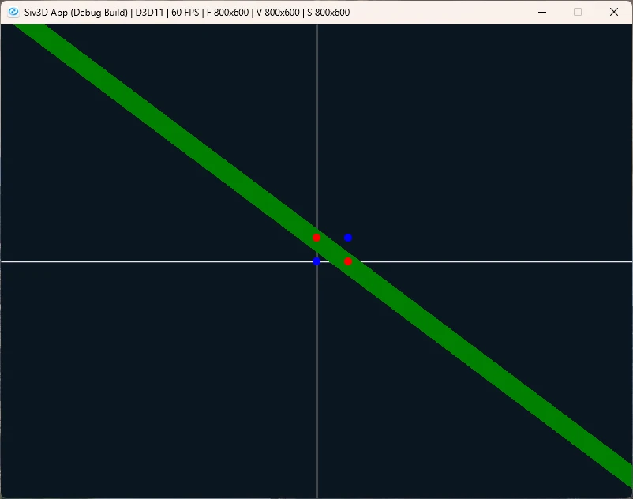

# Xor Gate  
次はXOR,真理値表は以下.  
| x1 | x2 | y |
| ------------ | ------------- | ------------ |
| 0 | 0 | 0 |
| 1 | 0 | 1 |
| 0 | 1 | 1 |
| 1 | 1 | 0 |  
さて、これはちょっと面倒.  
対角線上に点があるので直線で分けることができない!  
ではどうするのかというと、NandとOrという処理を通した後、Andを通す.これが正解.  
要は1つだけの処理じゃだめだけど、複数を組み合わせることで複雑な判断ができるようになるってこと.  
これが多層パーセプトロンの気持ちなんだろうなぁ.  

ということでコードは簡単、以下のようにすればよい.  
```c++
		NandGate nandGate;
		AndGate andGate;
		OrGate orGate;

		Vec2 medium = { nandGate.Evaluate(value), orGate.Evaluate(value) };
		return andGate.Evaluate(medium);
```
これで可視化をしてみよう.  
  
赤と青が分類で来ているのが分かる.  
緑の太い線が今回の処理を通したうえで、1となる範囲を可視化したものである.  
なんというか、本での分け方は曲線でぐにゃっと分けてるように見えるけど、実際に可視化すると直線で範囲を絞ってるという点が面白い.  

さて、これで二章は終了！  