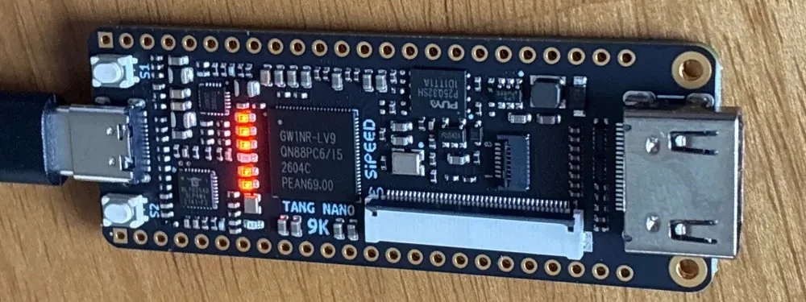

# Tang Nano 9kでLチカをやってく  
最近後輩に話を聞いてFPGAをやりたいな～と思って調べてたんだけど、ついに買った.  
Tang Nano 9K[^1]というやつで、凄い小さいんだけど初めて遊ぶのには良いならいいかな～と思って購入.  
20Kでもいいかなとも思ったけど、まあ高いしこっちでいいかとなったのは内緒.  

さてやっぱりこういう電子工作で一番最初にやることといえばLチカ.  
電子工作界のHello Worldはこれだというのが自分の認識、雑すぎる.  
Arduinoを始めて弄ったときもこれをやった気がする、あれももう7年前くらいだからこういうハードは久々ね.  

ということで今回は公式チュートリアル[^2]に従って実装をやっていく.  
その際に参考にしたのはここ[^3]、非常に分かりやすかった.  

まず最初は公式[^4]に行って登録、そしてEducation[^5]をダウンロード.  
ダウンロードはEducationであることに本当に注意.  
自分は最初に通常の方をダウンロードして、ライセンス認証で弾かれました.  
別段そういうのはいらないのよ、楽がしたいのよ.  

ダウンロードしたらexeをたたいて、`File/FPGA Design Project`で適当にプロジェクトを作成.  
`GW1NR-LV9QN88PC6/15`にデバイスを設定して、完了.  

ソースコードは`Verilog File`をとりあえず作成.  
名前は適当に.  
そしたらVerilogを書いていくことになる.  
初めてなのでそれっぽく雰囲気で読んでいく.  

まず最初にmoduleで入力と出力を設定する.  
`input`は入力,`output`は出力で、この段階ではあくまで抽象的なものである.  
実際の入力はボタンだったり、出力ならLEDとか具体的なものがあるけども、プログラム内ではあくまで`input`,`output`であるということが大事っぽい.  
とはいえ、今回はLチカである程度具体的なものはわかってる.  
`sys_clk`はクロック、`sys_rst_n`はリセット用のボタン,`led`はLEDとなる.  
Tang Nano 9KはLEDが6個あるので、配列で書いている.  
```verilog
module top(
    input sys_clk,          // clk input
    input sys_rst_n,        // reset input
    output reg [5:0] led    // 6 LEDS pin
);
```

そして、`reg`で値を保持するためのデータを用意しておく.  
`always`文を書く際はこれで変数宣言するっぽい.  
`[23:0]`とあるが、`[MSB:LSB]`という形らしく、最上位ビットと最下位ビットを指定してるっぽい.  
今回は24ビットを設定している感じかな？
`[2:2]`とかなら1ビットで`[2:1]`なら2ビットとかになるという認識.  
```verilog
reg [23:0] counter;
```

そしたら`always`文.  
何か信号に変更があったときにイベントを発行する処理.  
```verilog
always @(posedge sys_clk or negedge sys_rst_n) begin
```
イベントは`posedge sys_clk or negedge sys_rst_n`の二つ.  
まず`posedge`は`0->1`の変化が起こったときに発行.  
`negedge`は`1->0`の変化が起こったときに発行.  
今回は

* クロックが`0->1`になったとき
* リセットボタンが`1->0`,つまりボタンが押されたとき

の二つである.  
これがorとなってるので、片方が起こったときの状態がそのまま発行される.  
ボタンが押されてなくてもクロックが発動したら`1`の状態が発行されるし、ボタンを押したままクロックが発動したら`0`の状態が発行されるという感じ.  
あくまでイベント駆動なわけだね.  

そしたら処理を見ていこう.  
まずリセットボタンが押されている場合、つまり`0`となっているときはcounterをリセットする.  
`24'd0`は`24`はビット数, `'`は単純に区切り文字,`d`は10進数,`0`は代入する値となる.  
つまり簡潔に言えば`counter = 0;`ということだ.  
```verilog
    if (!sys_rst_n)
        counter <= 24'd0;
```

次はcounter周りの処理.  
```verilog
    else if (counter < 24'd1349_9999)       // 0.5s delay
        counter <= counter + 1'b1;
    else
        counter <= 24'd0;
end
```

基本的にカウンタは`counter + 1'b1`にある通り+1をし続ける.  
`counter++;`みたいなもんか.  
そして奇怪な`1349_9999`.  

どうもTang Nano 9Kは27MHzでクロックを行う.  
そのため,1秒に27M回クロックするので、$`27M/2=13.5M`$と半分にすれば0.5sということが分かる.  
つまり0.5秒立つまで待って、0.5秒立ったらカウンターをまたリセットしてるわけだ.  

さて、alwaysでもう一つ式を書く.  
verilogは上から下に順に処理を行うので,次に行う処理を書いてくことになる.  
まずリセットボタンを押したときの処理,この時はLEDを`1 0 0 0 0 0`に初期化.  
0が点灯で1が消灯.  
なので1つだけ消えた状態になる訳である.  

```verilog
always @(posedge sys_clk or negedge sys_rst_n) begin
    if (!sys_rst_n)
        led <= 6'b100000;
```

次にカウンターが0.5sまで来たときにずらす.それ以外はLEDを継続.  

```verilog
    else if (counter == 24'd1349_9999)       // 0.5s delay
        led[5:0] <= {led[4:0],led[5]};
    else
        led <= led;
end

endmodule
```

ビットをずらしている.これhlslの`float3 v; v.xzy`みたいな感じができるってことですね.  
処理としては  

* `1 00000`
* `0 00001`
* `0 00010`
* `0 00100`
* `0 01000`
* `0 10000`

というループをずっとやってるだけ.  

これでコードは書けたので、FPGA特有の処理をやっていく.  
まず`Project->Configuration->Place&Route->Dual-Purpose Pin`の`Use DONE as regular IO`をONにする.  
なんかエラー回避のためとチュートリアルには書いてあるけどよくわかってない.  

次に`Synthesize`をダブルクリックで論理合成を行う.緑のチェックが付けば成功.  
これで回路図を作りつつ、最適化をしてるっぽい.コンパイルみたいなもんかなぁ.  

次にConstrainの設定.  
先ほどのコードは`input`と`output`という抽象的なものを用意したに過ぎないけど、ここでちゃんと設定をすることで結びつけるわけだ.  
この時の結び付けはここのpdf[^6]を見るとわかる.  
Tang Nano 9Kの設計図で何がどのピンに対応してるのかが書いてある.  

まずクロック,`sys_clk`の設定.  
これはBANK1の51,52に書いてある.  
51は`IOR17B/GCLKC_3`で52は`IOR17A/GCLKT_3`らしい.  
`C`が差動クロックのマイナス側、`T`がプラス側らしい.わからん.  
今回は52の方を使用するので、Locationを52へ.  
また、BANK1は3.3Vらしいので、I/O Typeを`LVCMOS33`にする.  

次はボタン,`sys_rst_n`.  
BANK3でPIN3/4が対応するっぽい.  
今回は4の方をLocationに設定する.  
BANK1は1.8Vなので`LVCMOS18`のままでOK.  

最後にLED,`led`の設定.  
LEDは1から6まであるが、それぞれBANK3内の`10,11,13,14,15,16`に相当,Locationに設定.  
なんか12はLEDの先の信号に繋がってるっぽいけどこいつは何を意味してるんだ？  
まあそれはいいとして、BANK3でボタンと同じなため`LVCMOS18`のままでOK.  

ここまで出来たら次は`Place&Route`,配置配線.  
チップ上にどのように今まで作った回路図を配置するかを決める.  
これも自動で決めてくれるので、論理合成と同じでダブルクリックするだけ.  
緑のチェックが付けばOK.  

ここまでできればあとは実際にTang側にダウンロード.  
まずは`Programmer`をダブルクリックして開く.  
接続が成功したら、モードで`0`と`1`の謎の分岐があるけど`1`を設定.  
何故か`0`だと固まって失敗した,理由はわからない.  
`SRAM Program`にOperationがなっているのを確認出来たら、後は緑色の実行ボタンを押して実行！  

  

うん、いい感じ！  
今回はLチカをやった.  
次はLCDとかやりたいけど、そもそも手に入れないとなぁ...  

[^1]: [Tang Nano 9K](https://akizukidenshi.com/catalog/g/g117448/)  
[^2]: [Light LED](https://wiki.sipeed.com/hardware/en/tang/Tang-Nano-9K/examples/led.html)  
[^3]: [Tang Nano 9KでLチカ](https://elchika.com/article/d13ec9c3-a92d-418a-8550-8701dd7e75f1/)  
[^4]: [GOWIN](https://www.gowinsemi.com/ja/)  
[^5]: [「Gowin® EDA」のダウンロード](https://www.gowinsemi.com/ja/support/download_eda/)  
[^6]: [2_Schematic](https://dl.sipeed.com/shareURL/TANG/Nano%209K/2_Schematic)