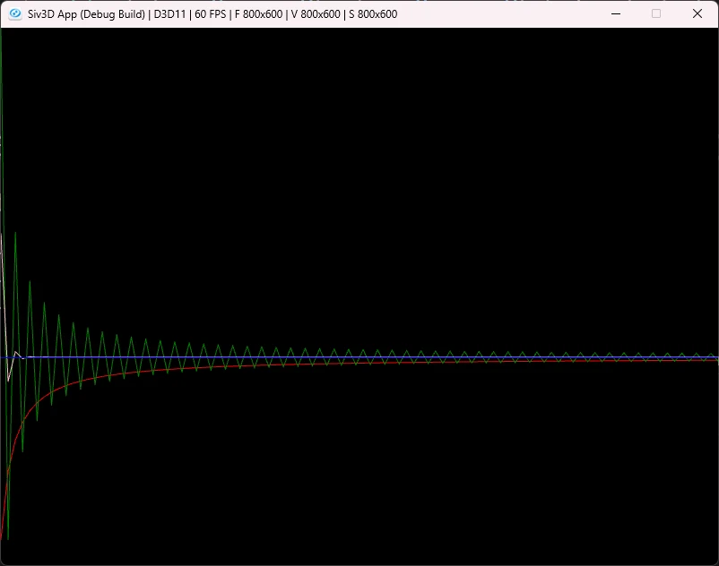

# グレゴリー級数とシャープの方法  
またしても円周率について考える回.  
今回もWiki[^1]を頼りに紐解いていく.  

マクローリン展開よりも前にインドでは天文学で級数を使っていた.  
ニーラカンタという15\~16世紀の天文学者が使っていたので、この学者が見つけた物だろう...  
と思ったら、この作者の本に自分よりも前の世代がみつけたと書いている、これはマーダヴァという天文学者らしい.  
彼のWiki[^2]もあったので見てみると、どうもヴィジャヤナガル王国の人っぽい.時代的には14\~15世紀くらいかしら.  
久々にヴィジャヤナガルという単語を聞いた気がする、ともあれここで大事なのは級数.  
マクローリン展開が見つかるよりもはるか前に、条件付きであれば既に級数は知られていたらしい.こういうの熱いよね.  
ここで見つかっていた式とは以下の形.  

```math
\begin{equation}
    \begin{split}
        \frac{\pi}{4} = 1 - \frac{1}{3} + \frac{1}{5} - \frac{1}{7} + \cdots
    \end{split}
\end{equation}
```

マクローリン展開がない時代にこれが見つかってるのはすごいな～という気持ち.  
これを「マーダヴァ級数」というらしい.  
この後見ていく級数にマーダヴァがついているんだけど、Wiki[^1]だとちょっと式が合わない.  
と思って調べてたら詳しい解説[^3]があった.ここ非常に分かりやすいうえに証明まで載ってる...天才だ.  

さて、それから時代がもう少しだけ進み時は17世紀.  
またまた天文学者、ジェームス・グレゴリーの登場！  
彼の功績はグレゴリー級数[^4]という、先程よりも一般化した形の級数を求める.  
この形は以下のような感じ.  

```math
\begin{equation}
    \begin{split}
        \arctan{x} & = x - \frac{x^3}{3} + \frac{x^5}{5} - \frac{x^7}{7} + \cdots \\
        & = \sum_{k=0}^{\infty} \frac{(-1)^{k} x^{2k+1}}{2k+1}
    \end{split}
\end{equation}
```

これ、x=1にするとマーダヴァとなるのが面白いところ.  
arctanにすることで、もう少し一般的な形になったんだね.  

ここでほぼ同じ時期にゴットフリート・ライプニッツが次のライプニッツの公式[^5]を見つける.  

```math
\begin{equation}
    \begin{split}
        \frac{\pi}{4} = \sum_{k=0}^{\infty} \frac{(-1)^n}{2n+1}
    \end{split}
\end{equation}
```

この式こそマーダヴァが求めていた式と一致する！！  
そのため、「マーダヴァ-ライプニッツ級数」と呼ぶこともある.  

さて、そしたらこのグレゴリー級数にx=1を代入したものを計算してみよう!!  
この式で$`\pi`$を求めたい場合は、以下のように変換するだけである.  

```math
\begin{equation}
    \begin{split}
        \pi &= 4 \sum_{k=0}^{\infty} \frac{(-1)^n}{2n+1}
    \end{split}
\end{equation}
```

これを計算すればOK.  
今回は初期値0から計算していく.  
$`2n+1`$を計算して、偶数かどうかで符号反転させる.  
後は4を掛けるのを忘れずに.  
```c++
class Gregory : public CalcFrame
{
public:
    Gregory() { InitValue(0.0, 0); }

    void Step() override
    {
        double n = (2.0 * static_cast<double>(m_iterate)) + 1.0;
        m_iterateValue += (m_iterate % 2 == 0 ? 1.0 : -1.0) / n * 4.0;

        // 更新
        m_values.push_back(m_iterateValue);
        m_iterate++;
    }
};
```

とはいえこれでも収束がまだ遅い...  
ここでGregoryをみると、arctanなので他の値を入れることでも$`\pi`$を求めるだけなら行けそうな気がする.  
同じようなことを考えたのがエイブラハム・シャープ[^6]で、彼は$`x=\frac{1}{\sqrt{3}}`$を代入した.  
これより,

```math
\begin{equation}
    \begin{split}
        \arctan{\frac{1}{\sqrt{3}}} &= \frac{\pi}{6} \\
        &= \frac{1}{\sqrt{3}}(1-\frac{1}{3*3}+\frac{1}{5*3^2} - \frac{1}{7*3^3} + \cdots)  
    \end{split}
\end{equation}
```

変形して

```math
\begin{equation}
    \begin{split}
        \pi = \frac{6}{\sqrt{3}}(1-\frac{1}{3*3}+\frac{1}{5*3^2} - \frac{1}{7*3^3} + \cdots)  
        &=\sum_{k=0}^{\infty} \frac{(-1)^{k} \ {(\frac{1}{\sqrt{3}}})^{2k+1}}{2k+1}
    \end{split}
\end{equation}
```


あとは数式に落とし込むだけ.  
$`x=\frac{1}{\sqrt{3}}`$とすると、回数は$`2k+1`$.  
最後に式をコードに落とし込めば終わり.  
```c++
class Sharp : public CalcFrame
{
public:
    Sharp() { InitValue(0.0, 0); }

    void Step() override
    {
        const double x = 1.0 / Sqrt(3);
        double n = (2.0 * static_cast<double>(m_iterate)) + 1.0;
        m_iterateValue += (m_iterate % 2 == 0 ? 1.0 : -1.0) / n * 6.0 * Pow(x, n);

        // 更新
        m_values.push_back(m_iterateValue);
        m_iterate++;
    }
};
```

さて、ここまで来たら結果を見てみよう.  

  

赤がWallis,緑がGregory,ピンクがSharp.  
こうしてみるとSharpの収束が他と比べても圧倒的に速いことが分かる.  
ここから分かることは円周率がただ求まることも大事だけど、それと同時に収束が速いという点も大事なことというのが上げられる.  
ということで今回はこの辺までかな、また円周率はやりたくなったらやろう.  

[^1]: [円周率の歴史](https://w.wiki/4kj6)  
[^2]: [マーダヴァ](https://w.wiki/TpHH)  
[^3]: [マーダヴァ～生涯と功績を解説！円周率を求める無限の公式とは？](https://mathsuke.jp/madhava/)  
[^4]: [Arctangent series(Gregory's series)](https://w.wiki/AWMj)  
[^5]: [ライプニッツの公式](https://w.wiki/47UH)  
[^6]: [エイブラハム・シャープ](https://w.wiki/TpJh)  