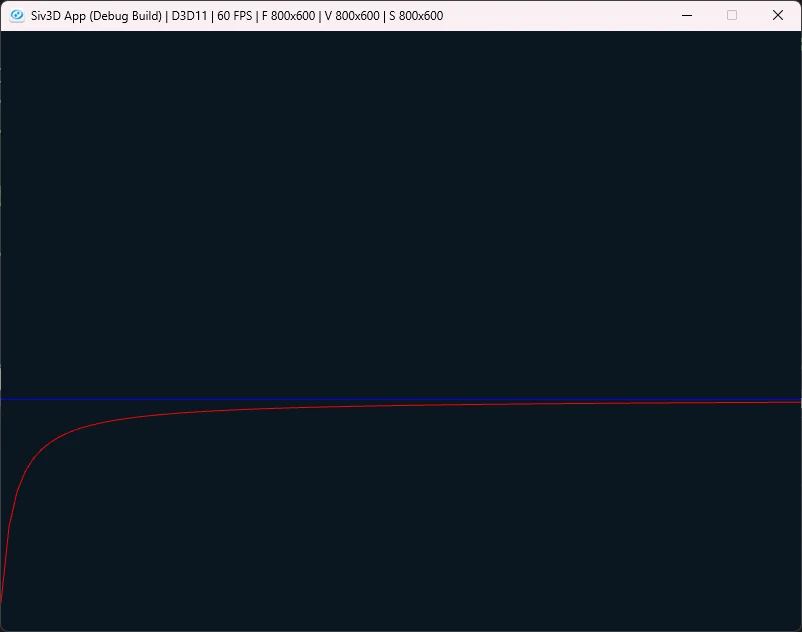

# ウォリスの公式  
たまには円周率のことを考えようと思い、まずはウォリスの公式から.  
こちらもWiki[^1]がシンプルで分かりやすい.  
この式の導出は歴史[^2]を見る感じ1655年.17世紀なんですね.  
式としては要は

```math
\begin{equation}
    \begin{split}
        \prod_{n=1}^{\infty} \frac{2n}{2n-1} \frac{2n}{2n+1} = \frac{\pi}{2}
    \end{split}
\end{equation}
```

となるわけである.  
実際に求めたい際は以下のように変形すればよい.  

```math
\begin{equation}
    \begin{split}
        \pi &= 2\prod_{n=1}^{\infty} \frac{2n}{2n-1} \frac{2n}{2n+1} \\
            &= 2\prod_{n=1}^{\infty} \frac{(2n)^{2}}{(2n-1)(2n+1)} \\
            &= 2\prod_{n=1}^{\infty} \frac{(2n)^{2}}{(2n)^{2} - 1}    
    \end{split}
\end{equation}
```

これを計算すればよいが、もちろん全部を足し合わせるのは計算では不可能...  
なので、途中まで計算して打ち切るということになる.  

今回は実装として基底として`CalcFrame`を用意.  
```c++
	class CalcFrame
	{
	public:
		virtual void Step() = 0;

		const Array<double> GetSamples() const { return m_values; }
		void InitValue(const double& value, const int iterate = 1) { m_iterateValue = value; m_iterate = 1; }

	protected:
		Array<double> m_values;
		double m_iterateValue; int m_iterate;
	};
```
`Step`関数を呼び出しあげればIterateが行われることになる.  
初期値に関しては`InitValue`で指定可能.  
また、`GetSamples`で全Valueを取得できる.  

Wallisは次のように定義.  
まず初期値は`2.0`で用意する、総積前の`2`に該当.  
```c++
class Wallis : public CalcFrame
{
public:
    Wallis() { InitValue(2.0); }
    
    // ...
};
```

そしたら後は総積の部分を各Iterateで計算するだけ.  
まず最初に$`(2n)^2`$を計算して、それを当てはめる.  
これだけで計算が出来る.式としては非常にシンプルな形.  
```c++
    void Step() override
    {
        double n = (2.0 * static_cast<double>(m_iterate));
        n *= n;
        m_iterateValue *= n / (n - 1.0);

        // 更新
        m_values.push_back(m_iterateValue);
        m_iterate++;
    }
```

これを描画した結果は以下のようになる.  

  

青い線が$`\pi`$で、赤い線がウォリスの公式.  
一応収束していってるのは分かるが、収束速度は非常に遅い.  
実際にあまり収束速度は良くないらしい.  
ということで今回はここまで、次回はグレゴリー級数でもやろうかな.  

[^1]: [ウォリス積](https://w.wiki/Tnxa)
[^2]: [円周率の歴史](https://w.wiki/4kj6)