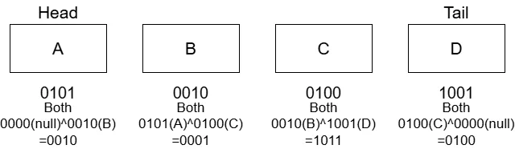

# XOR List  
ODSのList構造は前回ので全部終わっているが、DiscussionでXOR Listというものが書いてある.  
どうせならと思い、今回はこれの実装を行う.  
いままでの双方向連結リストの場合はNodeが以下のような構造になる.  

```c++
protected:
    struct Node
    {
        T m_value;
        std::shared_ptr<Node> m_prev;
        std::shared_ptr<Node> m_next;
    };
```

`prev`と`next`を持たせることで双方向へのアクセスが可能になる.  
できればこれを適当な`both`というポインタ1つにまとめてしまえば、今までのようなポインタ2つを持たせるよりもメモリを少なく対応できる.  
これを達成するようにするのが今回の目標！  
そのために、今回はNodeにポインタを持たせる.  

```c++
protected:
    struct Node
    {
        T m_value;
        Node* m_both;
    };
```

ポインタ1つのみなので、これだと双方向へのアクセスができなさそう...  
そこで使うのがXOR演算.  
ポインタ同士にXORを行うことで、上手く左右の演算ができるようになる.  
XORの演算は次のように定義.  
```c++
protected:
    // XOR演算
    Node* XorOperate(Node* lhs, Node* rhs)
    {
        return reinterpret_cast<Node*>(reinterpret_cast<std::intptr_t>(lhs) ^ reinterpret_cast<std::intptr_t>(rhs));
    }
```

やってることは以下のような真理値をbit毎に計算しているだけである.  

| x1 | x2 | y |
| ------------ | ------------- | ------------ |
| 0 | 0 | 0 |
| 1 | 0 | 1 |
| 0 | 1 | 1 |
| 1 | 1 | 0 |  

両方のビットが同じ値なら0,違うなら1というXORを取ってるだけ.  

今回リスト側にはHeadとTailを持たせて、どっちからでも辿れるようにする.  
```c++
protected:
    Node* m_head;
    Node* m_tail;
    int m_size;
```

今回作るデータはこんな感じのデータ.  

  

Node Aのポインタは`0101`,Node Bのポインタは`0010`のような感じになっている.  
そしてこのノードにはデータが入っているという状態.  
`both`は隣接したデータのポインタに対して、`XOR`を取った状態となる.  
Node BであればAのポインタとCのポインタのXOR.  
Node CであればBのポインタとDのポインタのXORって感じ.  

Headの場合は片方は何もない状態.  
そのため、nullである0とXORを取るようにする.  

これを考慮しつつまずは先頭へのNodeの追加を書いてみる.  
先頭への追加なのでHead側への追加となる.  
Nodeを作成して値を入れる.  
その後、bothは先頭に追加するため、nullとheadに対してのXORを入れておく.  
上の図で言えば`B C D`のNodeがある状態でAを追加するとすれば分かりやすい.  
`m_head`は`B`の状態となっていて、Aのbothは`B`と`null`のXORなので、これでOKなのである.  
```c++
void PushFront(T value)
{
    // node -> prevHead の形式になるように設定
    Node* node = new Node();
    node->m_value = value;
    // nullptrとxorしてもheadの値になるだけなので、そのまま突っ込む
    // ex: 110(head) ^ 000(nullptr) = 110 みたいなもの
    node->m_both = m_head;
}
    // ...
```

そして、Bの`m_both`もAとCのXORにするために書き換えが必要.  
そのため`headPrev`にAと同等のものを入れて、`headNextに`C`のものを入れる.  
あとはこの二つでXORを取れば、Bの`m_both`も臨んだ形となる.  
```c++
    if (m_head != nullptr)
    {
        // headのPrevをnodeに置き換えて計算
        Node* headPrev = node;
        Node* headNext = XorOperate(m_head->m_both, nullptr);

        // bothを更新
        m_head->m_both = XorOperate(headPrev, headNext);
    }
```

もしもheadがまだ何もない場合は`tail`に同じようなNodeを入れておく.  
あくまで後ろからも1つのデータだけでも辿れるようにするための処置だね.  
最後にheadに作ったNodeを登録すればOK.  
```C++
    else
    {
        // nullptr <=> node <=> nullptrの構造にしておく
        m_tail = node;
    }

    // headを更新
    m_head = node;

    // Count Up
    m_size++;
```

次は逆に`A,B,C`のNodeがある状態で`D`を追加する場合.  
この場合もDの`m_both`が`C`とnullでXORを取って、`C`は`B,D`のポインタでXORを取るだけで全く処理は同じ.  
```c++
void PushBack(T value)
{
    // node -> prevHead の形式になるように設定
    Node* node = new Node();
    node->m_value = value;
    // nullptrとxorしてもtailの値になるだけなので、そのまま突っ込む
    // ex: 110(tail) ^ 000(nullptr) = 110 みたいなもの
    node->m_both = m_tail;

    if (m_tail != nullptr)
    {
        // tailのNextをnodeに置き換えて計算
        Node* tailPrev = XorOperate(m_tail->m_both, nullptr);
        Node* tailNext = node;

        // bothを更新
        m_tail->m_both = XorOperate(tailPrev, tailNext);
    }
    else
    {
        // nullptr <=> node <=> nullptrの構造にしておく
        m_head = node;
    }

    // tailを更新
    m_tail = node;

    // Count Up
    m_size++;
}
```

さて、XORのデータが作れればデータを辿ることがすでに可能になっている.  
`Print`関数を今回は作って、どうやってたどるのかを見てみよう.  
今回は先頭から辿る場合を考えてみる.  
`current`に`A`,prevに`null`となるようにする.  

```c++
void Print()
{
    Node* current = m_head;
    Node* prev = nullptr;
    String prints;

    // ...
}
```

辿る際の関数は以下のような感じ.  
```c++
    while (current)
    {
        prints += Format(current->m_value) + U",";

        // 次へ
        Node* next = XorOperate(prev, current->m_both);
        prev = current;
        current = next;
    }

    s3d::Print << prints;
    s3d::Print << U"Size: " << Size();
```

各Nodeには文字列で`A`,`B`,`C`,`D`が入ってるとしてみよう.  

まず最初のループ、currentが`A`でprev`null`の場合.  
`A,`という文字列を格納.  
その後、`next= 0000(null)^0010(A->m_both)=0010(B)`となる.  
こうして、`prev=A,current=B`をいれて終了.  

次のループ、`prev=A,current=B`なのでループは継続.  
`A,B,`という文字列を格納.  
その後、`next= 0101(A)^0001(B->m_both)=0100(C)`となる.  
こうして、`prev=B,current=C`をいれて終了.  

次のループ、`prev=B,current=C`なのでループは継続.  
`A,B,C,`という文字列を格納.  
その後、`next= 0010(B)^1011(C->m_both)=1001(D)`となる.  
こうして、`prev=C,current=D`をいれて終了.  

次のループ、`prev=C,current=D`なのでループは継続.  
`A,B,C,D,`という文字列を格納.  
その後、`next= 0100(C)^0100(D->m_both)=0000(null)`となる.  
こうして、`prev=D,current=null`をいれて終了.  

次のループ、`prev=C,current=null`なのでループは終了.  
文字列が`A,B,C,D,`となるため、ちゃんと辿れてるのが分かる！！  

これ不思議な感じがするけど、ちゃんと考えてみると分かりやすい.  
Bの`m_both`を考えてみると$`A^C`$である.  
そして、実際に次に辿るときは$`A^(A^C)`$という演算をやる.  
これを実際にやると以下のようになる.  

```math
\begin{equation}
    \begin{split}
		A^(A^C) &= (A^A) ^ C \\
        &= 0 ^ C \\
        = C
    \end{split}
\end{equation}
```

こんな感じでAとCのXORをbothに入れておけば、前の状態のポインタが上手く打ち消してくれて次のものが求まるという訳だ.  

CからBという逆方向を求める場合も同じ感じだ.  
Cの`m_both`は$`B^D`$であり,逆から辿るので`(B^D)^D`という風になる.  

```math
\begin{equation}
    \begin{split}
		(B^D)^D &= B ^ (D^D) \\
        &= B ^ 0 \\
        = B
    \end{split}
\end{equation}
```

いや～、XORを使うことで上手く求められるわけだ！賢い～.  

一応削除に関しても見ておこう.  
やることは先ほどと同じで、先頭を消してつなぎ合わせを変えてあげればよい.  
まず`current=A`,`next=A->both=null^B=B`として考えよう.  
つまり、`current=A,next=B`だ.  
```c++
void PopFront()
{
    // データがないならReturn
    if (m_head == nullptr)
    {
        return;
    }

    Node* current = m_head;
    Node* next = current->m_both; // headなので、bothはnextのポインタと同じはず

    // ...
```

この場合`B`がHeadになるので,`A^(B->m_both)=A^(A^C)=C`でポインタを求めて、`nextNext=C`とする.  
そして、`B->m_both=null^C=C`のようになるため,そのまま`nextNext`を突っ込んであげる.  
```c++

    if (next)
    {
        // currentはnextから見たらprevなので、XORすると更にnextが手に入る
        // current <=> next <=> nextNext の場合、nextNextのpointerを手に入れて、
        // nullptr <=> next <=> nextNextにしてる
        Node* nextNext = XorOperate(current, next->m_both);
        next->m_both = nextNext;
    }

    // ...
```

もし次がない場合は今のノードを消した何も残らないので、`tail`側のデータも消す.  
```c++
    else
    {
        // nullptr <=> nullptrの構造にしておく
        m_tail = nullptr;
    }
    // ...
```

あとは`head`を更新して、先頭のノードを消してあげれば終わり.  
```c++
    // headを更新
    m_head = next;

    // 削除
    delete current;

    // Count Down
    m_size--;
}
```

今回は先頭からだったけど、後ろから消すことも可能.  
これは同じ流れで組んであげればよい.  
説明はしないが、全く同じ流れで削除が可能！  
```c++
void PopBack()
{
    // データがないならReturn
    if (m_tail == nullptr)
    {
        return;
    }

    Node* current = m_tail;
    Node* prev = current->m_both; // headなので、bothはprevのポインタと同じはず

    if (prev)
    {
        // currentはprevから見たらnextなので、XORすると更にprevが手に入る
        // prevPrev <=> prev <=> current の場合、prevPrevのpointerを手に入れて、
        // prevPrev <=> prev <=> nullptrにしてる
        Node* prevPrev = XorOperate(current, prev->m_both);
        prev->m_both = prevPrev;
    }
    else
    {
        // nullptr <=> nullptrの構造にしておく
        m_head = nullptr;
    }

    // headを更新
    m_tail = prev;

    // 削除
    delete current;

    // Count Down
    m_size--;
}
```

これがXOR List.  
ポインタという唯一のデータと`XOR`演算を上手く使うことで、データ量を減らすという賢いものでした～.  
これで三章も終わり.  
