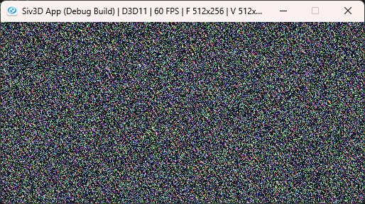
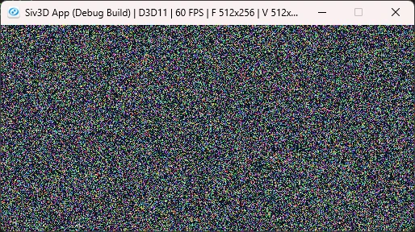
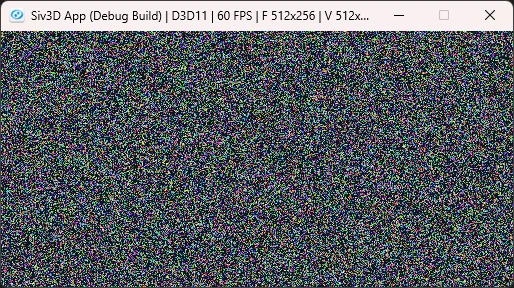

#  Linear congruential generators(LCG): 線形合同法  
疑似乱数を使用する際の計算方法は色々あるが、その中でも特にシンプルなものと言えばLCG[^1].  
以下の漸化式に従うように計算をおこなうだけである.  

```math
\begin{equation}
    \begin{split}
		X_{n+1} = (A X_{n} + C) mod M
    \end{split}
\end{equation}
```

実際に組み込むときは簡単.  
$`M,A,C`$を定数として決めて、初期値となるseedとして$`x_{n}`$を用意する.  
後は何度も必要に応じて`step`関数を呼び出せばよいだけである.  
```c++
	// a = 2^16 + 3 = 65539
	// m = 2^31 - 1 = 2147483647, メルセンヌ素数のためxと互いに素になりにくい
    constexpr long long int a = 65539;
    constexpr long long int c = 0;
	constexpr long long m = 2147483647;

	long long int x_n = 10000; // 初期値
	auto step = [&]()
		{
			x_n = (a * x_n + c) % m;
			return x_n;
		};
```

あとは$`A,C,M`$をどう決めるかだけど、有名なところだけを見ていく.  

RANDU[^2],$`M=2^{31},A=65539,C=0`$となる.  
これは1960\~1970年代に使用されたもので、設計としてはあまりにお粗末なもの.  
試しに出力した結果は以下.  

  

MINSTD[^3],$`M=2^{31}-1,A=7^{5}=16807,C=0`$となる.  
1988年らしい、実装として簡単で良質で効率的で良ければこれでも問題ないということらしい.  
C++11の`minstd_rand0`とかではこれが使われているっぽい.  
試しに出力した結果は以下.  

  

よく見る実装[^4],$`M=2^{32},A=1103515245,C=12345`$となる.  
何処から出たかは分からないけどPOSIXのrandの解説中にあるためよく使われてる？  
でも、質はあまりよくないらしい.  
試しに出力した結果は以下.  

  

他にもいろいろあるけど、一旦はこれくらいでやめとこうかな.  
また気が向いたら追加するかもしれない.  

[^1]: [Linear congruential generator](https://w.wiki/tV5)  
[^2]: [RANDU](https://w.wiki/UFz8)  
[^3]: [Lehmer random number generator](https://w.wiki/UFzz)  
[^4]: [線形合同法](https://w.wiki/6FFa)  