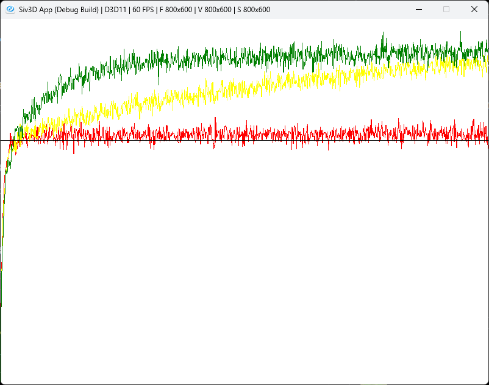
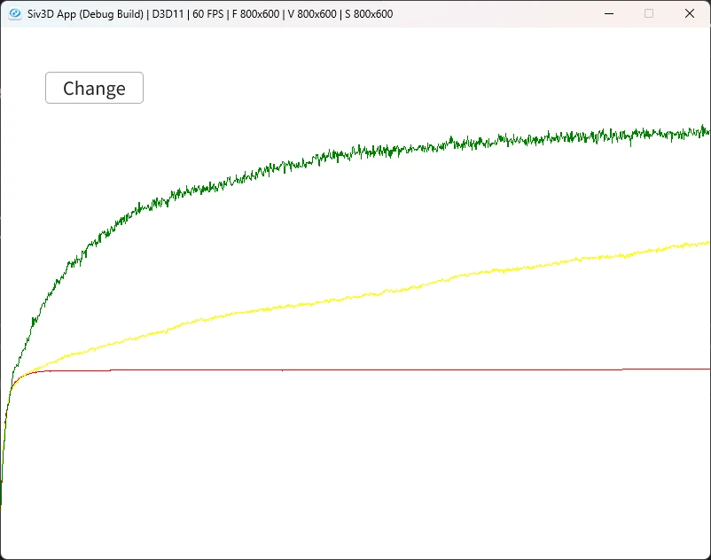

# BunditEpsilonGreedy  
バンディット問題のActionを見直そう.  
```c++
int Action() const
{
    // 予測の最大値
    double best = *std::max_element(m_estimates.begin(), m_estimates.end());

    // 最大値のものを取り出す
    Array<int> index;
    for (int count = 0; const auto& value : m_estimates)
    {
        if (best == value) { index.push_back(count); }
        count++;
    }

    // 一つ選ぶ
    return index.choice();
}
```
最大値の値のものを選択していた.  
が、これにはちょっと欠点があって、初期値が0なので、もし初回でスロットマシンが0を下回らない限りそれ以外のものを探索しない.  
もしもより良いものがあっても、探索をしないということになる.  
これを解決するための一つの方法がEpsilonという小さい確率で別の手を選ぶということである.  
式で表せばこんな感じ.  
```math
\begin{equation}
    \begin{split}
    & A \leftarrow argmaxQ(a) (Prob: 1- \epsilon) \\
    & A \leftarrow Random Value (Prob: \epsilon) \\
    \end{split}
\end{equation}
```
要はεという小さい値として考えると、大半は最大値による選択を行う.  
が、εが小さい値なので、これは非常に小さい確率でランダムに選択を行うことになる.  
これにより、袋小路になった場合でも、小さい確率で別の手もちゃんと選ぶようになる.  
これを実装すると以下のようになる.  
```c++
int Action() const
{
    double value = Random(0.0, 1.0);
    if (value < m_epsilon)
    {
        return Random(0, m_arm - 1);
    }

    // 予測の最大値
    double best = *std::max_element(m_estimates.begin(), m_estimates.end());

    // 最大値のものを取り出す
    Array<int> index;
    for (int count = 0; const auto & value : m_estimates)
    {
        if (best == value) { index.push_back(count); }
        count++;
    }

    // 一つ選ぶ
    return index.choice();
}
```
基本的には最大値の方を選ぶのだが、低い確率で別のスロットマシンを選んでいる.  
以下の部分がその部分.  
```c++
double value = Random(0.0, 1.0);
if (value < m_epsilon)
{
    return Random(0, m_arm - 1);
}
```
今回は二つの図を書いていくため、そのためのデータ用意をしていく.  
```c++
for (int r = 0; r < runs; r++)
{
    bandit.Reset();
    for (int i = 0; i < times; i++)
    {
        int action = bandit.Action();
        meanRewards[i] += bandit.Step(action);

        if (action == bandit.m_bestAction)
        {
            bestActions[i] += 1.0;
        }
    }
}
```
meanRewardsは前にやったのと同じ.  
追加となるのはbestActions,よい手であったら+1するだけである.  
後は割るのを忘れずに.  
```c++
std::for_each(meanRewards.begin(), meanRewards.end(), [runs](double& value) {value /= runs; });
std::for_each(bestActions.begin(), bestActions.end(), [runs](double& value) {value /= runs; });
```
さて、まずは平均報酬から.  
  
赤が$`\epsilon =0`$,黄色が$`\epsilon =0.01`$,緑が$`\epsilon=0.1`$となる.  
確かに$`\epsilon`$がある方がよい結果となってる.  
次に最適行動,要はよい手.  
  
色と数値は先ほどと同じものとなる.  
こちらも$`\epsilon`$がある方がよい手となる.  