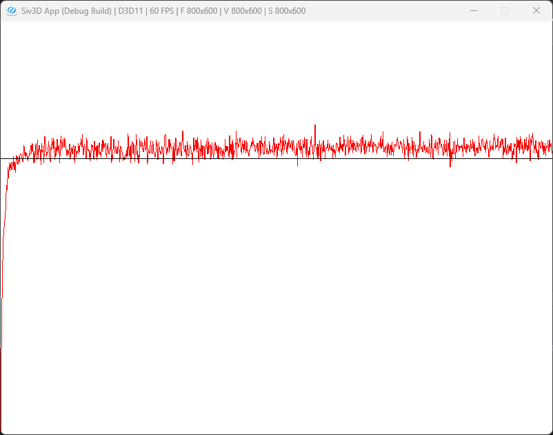

# BunditGreedy  
  
Suttonの第二章のバンディット問題をやってみよう.  
K-腕バンディット問題というやつで、問題としては非常にシンプル.  
スロットマシンが数台あって、一つだけを選んで引くことができる.  
スロットマシンを引くことで、ランダムな得点を得られる.  
この際の得点は2\~3,2\~5,1\~2というような分布になっているとすると、2\~5のスロットマシンを引き続ければ一番得点が得られるというのは直感的にわかると思う.  
これを実際にプログラムとして解くことが目標となる.  
まずはバンデット問題用のパラメータを用意していこう.  
```c++
class Bandit
{
//...

public:
	int m_arm = 10; // 腕の数
	int m_stepCount = 0; // ステップ回数

private:
	// Seed関係
	std::random_device m_seedGen;
	std::default_random_engine m_engine = std::default_random_engine(m_seedGen());
	std::normal_distribution<> m_distribution = std::normal_distribution<>(0.0, 1.0);
	Array<double> m_realRewards; // rewardの真値
	Array<double> m_estimates; // rewardの予測
	Array<int> m_actionCounts; // 各腕でactionが行われた回数
};
```
腕の数とステップ数はわかりやすい.  
今回は10個のスロットマシンがあるのと同じ想定で考える.  
```c++
	// Seed関係
	std::random_device m_seedGen;
	std::default_random_engine m_engine = std::default_random_engine(m_seedGen());
	std::normal_distribution<> m_distribution = std::normal_distribution<>(0.0, 1.0);
```
この辺は乱数を得るためのパラメータ、要はスロットマシンにおける得られる得点の乱数に相当する.  
```c++
	Array<double> m_realRewards; // rewardの真値
	Array<double> m_estimates; // rewardの予測
	Array<int> m_actionCounts; // 各腕でactionが行われた回数
```
報酬の実際の値,報酬の予測値,そしてどのスロットマシンが何回押されたかのカウントの三つ、配列だけど腕の数なので10個想定.  
そしたらまずは初期化から見ておこう.  
```c++
void Reset()
{
    m_realRewards.clear(); m_realRewards.resize(m_arm);
    m_estimates.clear(); m_estimates.resize(m_arm);
    m_actionCounts.clear(); m_actionCounts.resize(m_arm);

    for (int i = 0; i < m_arm; i++)
    {
        m_realRewards[i] = m_distribution(m_engine);
        m_estimates[i] = 0.0;
        m_actionCounts[i] = 0;
    }

    m_stepCount = 0;
}
```
腕の数だけ初期化をしておき、書く腕の値を0で初期化する.  
rewardに関しては乱数としておく.  
ステップ数は0に初期化しておく.これで終わり.  
さて、バンディット問題の評価に関しては以下のような手順で行う.  
```math
\begin{equation}
    \begin{split}
    & A \leftarrow argmaxQ(a) \\
    & R  \leftarrow bandit(A) \\
    & N(A) \leftarrow N(A) + 1 \\
    & Q(A) \leftarrow Q(A) + \frac{1}{N(A)}[R - Q(A)]
    \end{split}
\end{equation}
```
一つずつ見ていこう.  
```math
\begin{equation}
    \begin{split}
    A \leftarrow argmaxQ(a)
    \end{split}
\end{equation}
```
まずは現在の推定値から最大の値を取得する.  
```math
\begin{equation}
    \begin{split}
        & R  \leftarrow bandit(A) \\
        & N(A) \leftarrow N(A) + 1
    \end{split}
\end{equation}
```
その後、乱数で値を取得した後、試行回数を+1しておく.  
```math
\begin{equation}
    \begin{split}
    Q(A) \leftarrow Q(A) + \frac{1}{N(A)}[R - Q(A)]
    \end{split}
\end{equation}
```
最後に推定値を更新する.  
現状の報酬に対して、R-Qという値で計算する.  
これは現在の推定値Qと今回の取得したRが近ければ更新値は小さくなり,QとRの差が大きければ更新値は大きくなる.  
もしNが大きい、つまり試行回数が多ければ、その分影響値は小さくなる.要は更新回数が多くなるほど影響は小さくなるというわけ.  
これをコードにしていこう,まずは(2)の処理から.  
```c++
// バンデットでのアクションを行うIndexを返す
int Action() const
{
    // 予測の最大値
    double best = *std::max_element(m_estimates.begin(), m_estimates.end());

    // 最大値のものを取り出す
    Array<int> index;
    for (int count = 0; const auto& value : m_estimates)
    {
        if (best == value) { index.push_back(count); }
        count++;
    }

    // 一つ選ぶ
    return index.choice();
}
```
最大値を取得して、その値と同じIndexを取り出す.  
最大値が複数ある場合もあるため、その中からchoiceで選択するようにする.  
例えば初回なんかは推定値はすべて同じである.  
そのため、すべての腕の中からランダムで選択する、といった具合である.  
次に実際に(3)~(4)の処理を行う.  
```c++
double Step(int action)
{
    // (3): R
    // Rewardの取得
    double reward = m_distribution(m_engine) + m_realRewards[action];

    // (3): N
    // ステップを一つ足しておく
    m_stepCount++;
    m_actionCounts[action]++;

    // (4): Q
    // 推定を更新
    m_estimates[action] += (reward - m_estimates[action]) / m_actionCounts[action];

    return reward;
}
```
Rは乱数で取る,Nはincrementするだけ.  
Qも式通りに計算するだけなので、特に難しくはないね.  
最後に今回は図を描くための処理を行っていこう.  
```c++
constexpr int runs = 2000; // 10本腕x2000
constexpr int times = 1000; // 1000回試行

Bandit bandit;

Array<double> meanRewards; meanRewards.resize(times, 0.0);

// Simulate
for (int r = 0; r < runs; r++)
{
    bandit.Reset();
    for (int i = 0; i < times; i++)
    {
        int action = bandit.Action();
        meanRewards[i] += bandit.Step(action);
    }
}
```
今回は10本腕バンディットを2000個動かす.  
更に各試行回数は1000回,つまり2000個x1000回の思考となる.  
シミュレーションはバンディットをリセットして、Action/Stepで試行するだけ.  
結果はmeanRewardで結果を足しておく.  
```c++
std::for_each(meanRewards.begin(), meanRewards.end(), [runs](double& value) {value /= runs; });
```
後は最後にruns,つまり2000個で割れば平均値となる.  
これをグラフにすればタイトルの画像が得られる.  