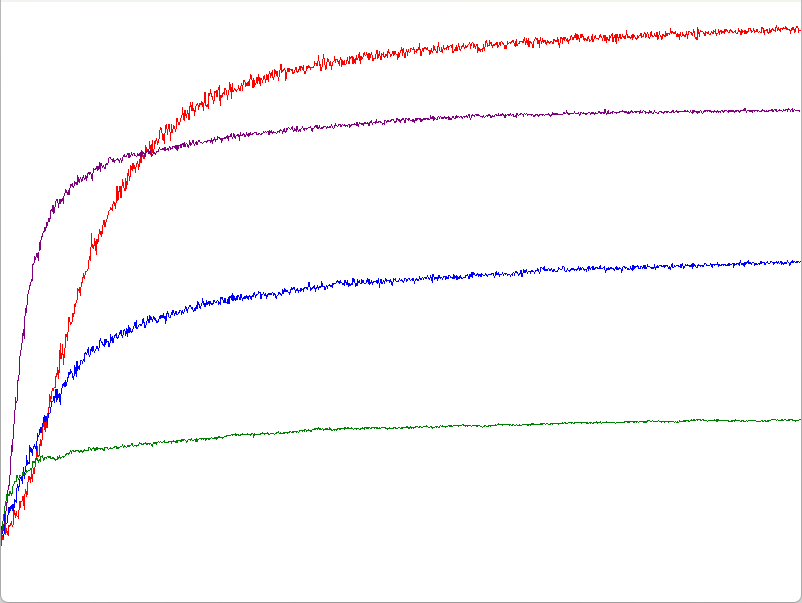

# GradientBaseline  
今回は有名なソフトマックスを考えてみる.  
ソフトマックス関数は次のような感じの形状.  
```math
\begin{equation}
    \begin{split}
    P_r\{A_t=a\} \dot{=} \frac{e^{H_t(a)}}{\sum_{b=1}^{k} e^{H_{t}(a)}} \dot{=} \pi_t (a)
    \end{split}
\end{equation}
```
うまくexponentを使って重みづけしている.  
要は確率みたいなもので、exponentを抜きにすれば簡単に理解しやすい.  
ちなみにHは推定値なので、推定値によって確率を決めているということになる.  
例えばだけどAとBとCという三個のバンディットがあったとすると、以下のような三つの式として考えられる.  
```math
\begin{equation}
    \begin{split}
    & P_{1}=\frac{A}{A+B+C} \\
    & P_{2}=\frac{B}{A+B+C} \\
    & P_{3}=\frac{C}{A+B+C}
    \end{split}
\end{equation}
```
これを足し合わせると以下のようになる.  
```math
\begin{equation}
    \begin{split}
    P_{1} + P_{2} + P_{3} = \frac{1}{A+B+C} * (A+B+C) = 1
    \end{split}
\end{equation}
```
こんな感じで、$`P_{1},P_{2},P_{3}`$は1以下の確率で、すべてを足し合わせると1になるといった感じの確率密度みたいな感じと言える.  
ソフトマックス関数もこんな風に考えられるというだけ.  
確率として考えれば、ソフトマックスは割とすっと入ってくる.  
そしたら問題となるのは$`H`$であるが、これは次のように定義する.  
```math
\begin{equation}
    \begin{split}
    & H_{t+1}(A_t) \dot{=} H_{t}(A_t) + \alpha (R_t - \bar{R_t})(1 - \pi_{t}(A_t))
    \end{split}
\end{equation}
```
まずこの式はActionで選択された手の場合の式となる.  
要は推定値としては選ばれた場合は上げたいし、選ばれてない場合は下げたい.  
これはバンディットで選ばれた手に関しては評価値を上げて、選ばれてない場合は下げたいといった感じになる.  
さて、そうなるとHの値が反映される$`\pi`$が大事な値になってくる.  
推定値を上げる場合は1から確率を引いている.  
要は選ばれやすい場合はすでに何度も評価されてる可能性が高いので、上げ幅は小さくしたくて、選ばれてない場合は上げ幅を大きめにしたいといった感じである.  
そして$`R`$に関しては報酬だった、では$`\bar{R}`$は何かというと、これはベースラインというものである.  
ここで式の中で符号が負になる可能性があるのはこの報酬だけである.  
確率は1より大きくならないので、1から引いてた結果の最低値は0だから$`\pi`$の入っている部分は0より小さくはならない.  
そうなるとこのベースラインというのは報酬がベースラインよりも大きければ評価値を上げる,ベースラインよりも小さければ評価値を下げるということになる.  
要は報酬を得てもちゃんとベースライン以上に結果を出さないと評価値は上がっていかないという抑制をしてくれてるわけである.  
あともう一つ、$`\alpha`$はステップサイズというものでどれくらい影響させるかのハイパーパラメータ.  
これが大きければ影響は大きいし、小さければ影響は小さい、まあ掛けてるのでそのままだね.  
そしたら次はActionで選ばれなかった手の評価値はどうなるかというと、以下の式で行われる.  
```math
\begin{equation}
    \begin{split}
    H_{t+1}(a) \dot{=} H_{t}(a) - \alpha (R_t - \bar{R_t}) \pi_{t}(a)
    \end{split}
\end{equation}
```
この式は$`H_{t}(a)`$に対してマイナスをしている.  
つまりは評価としては、選ばれていないので下げていくということになる.  
下げ幅に関しては$`\pi_{t}(a)`$と確率はなっているので、要はよく選ばれてる手は大きく下げて、選ばれない手は小さめに下げるということになる.  
そして先ほども言った通り報酬が符号変換のトリガーだった.  
ここで大事なのは対象となる報酬は選んだ手に関しての報酬である点である.  
要はA,B,Cという手があって、今回はAを選んだとすれば、Aに対する報酬であるってこと.  
BとCの評価にはAを選んだ際の報酬を使うのである、Bを評価する際はBを選んだ際の報酬ではここではないというのが超重要.  
なので、Aを選んだ際がベースライン計算後も正なら他の手は評価が下がる.  
だが、Aを選んだ際、ベースライン計算後負になる場合はもしかしたらBとCによい手があるかもしれないということで逆にこっち側の確率が上がるのである！！  
ここがややこしいが重要な点、最初式を見たとき自分もこんがらがったので、あくまで選んだ手の推定値で評価するという点はしっかり押さえておきたい.  
そしたら、実際にコードを見ていこう.  
```c++
if (m_isGradient)
{
    return ActionGradient();
}
```
まずは最初にAction時の処理も書き換える.  
確率に関してはちゃんとソフトマックスを使っていくことになる.  
```c++
Array<double> expEstimates;
double expEstimateSum = 0.0;
for (int i = 0; i < m_estimates.size(); i++)
{
    double expValue = Exp(m_estimates[i]);
    expEstimateSum += expValue;
    expEstimates.push_back(expValue);
}
```
まずは分子を計算しつつ、分母用の足し合わせもしておく
```c++
for (int i = 0; i < m_actionProbs.size(); i++)
{
    m_actionProbs[i] = expEstimates[i] / expEstimateSum;
}
```
そしたら分子分母で割ってあげればソフトマックスの計算が終わり、これが確率となる.  
```c++
std::discrete_distribution<std::size_t> distribution(m_actionProbs.begin(), m_actionProbs.end());
return distribution(m_engine);
```
最後に求めた確率を使って、実際にどの手がよいかを選べばよい.  
離散確率分布として生成後、選ぶだけである.  
ここまでの処理をまとめると以下のようになる.  
```c++
int ActionGradient()
{
    Array<double> expEstimates;
    double expEstimateSum = 0.0;
    for (int i = 0; i < m_estimates.size(); i++)
    {
        double expValue = Exp(m_estimates[i]);
        expEstimateSum += expValue;
        expEstimates.push_back(expValue);
    }

    for (int i = 0; i < m_actionProbs.size(); i++)
    {
        m_actionProbs[i] = expEstimates[i] / expEstimateSum;
    }

    // 一つ選ぶ
    std::discrete_distribution<std::size_t> distribution(m_actionProbs.begin(), m_actionProbs.end());
    return distribution(m_engine);
}
```
さて、あとは更新時がどうにかなればOK.  
次はここを見ていく.  
```c++
// 選択したもののみ1の配列
Array<double> oneHots;
oneHots.resize(m_estimates.size(), 0.0);
oneHots[action] = 1.0;

```
まずは最初にどの手が選ばれたかについて配列で用意する.  
基本的に全部の推定値に対して0になるが、選ばれた手のみ1にしておく.  
こうすることで、先ほどの式で$`1-\pi`$か$`\pi`$かを分岐できる.  
1なら(4)の式だし、0なら(5)の式ということになる.  
```c++
// ベースラインの設定
double baseline = 0.0;
if (m_isGradientBaseline)
{
    baseline = m_averageReward;
}
```
そしてベースライン、ベースラインを使う場合のみ値を入れるようにする.  
```c++
// 更新
for (int i = 0; i < m_estimates.size(); i++)
{
    m_estimates[i] += m_stepSize * (reward - baseline) * (oneHots[i] - m_actionProbs[i]);
}
```
後は実際に式を計算するだけ、(4)と(5)をうまく吸収している.  
もしonehotsが0だったとしても、$`- \pi`$となって、うまく+と-のつじつま合わせもここで行えてるわけである.  
ここまでの流れをまとめると以下のような感じになる.  
```c++
// 選択したもののみ1の配列
Array<double> oneHots;
oneHots.resize(m_estimates.size(), 0.0);
oneHots[action] = 1.0;

// ベースラインの設定
double baseline = 0.0;
if (m_isGradientBaseline)
{
    baseline = m_averageReward;
}

// 更新
for (int i = 0; i < m_estimates.size(); i++)
{
    m_estimates[i] += m_stepSize * (reward - baseline) * (oneHots[i] - m_actionProbs[i]);
}
```
さて、今回の比較結果は以下のようになる.  
  
まず赤と紫はベースラインあり、青と緑はベースラインなしの場合である.  
ベースラインがある方が非常に良い精度となってるのがこれで明らか.  
そして次に赤と青は$`\alpha = 0.1`$で、紫と緑は$`\alpha = 0.4`$である.  
つまり、あまりにステップサイズが大きいと影響度が大きすぎるため、適度に小さい方がよい精度になりやすいということになる.  
ただし、小さすぎるとそれはそれで影響度が小さくなりすぎるので、ある程度加減が必要ではあるとは思うけども...試してはない、怠惰.  