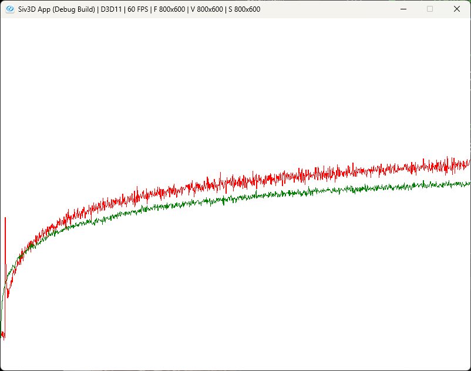

# Optimistic Initial
前回と同様にどうすれば別の手を選ぶことができるかを考える.  
今初期値は0である、この場合例えば1~2というのが得られるスロットマシンであった場合、他の手を選ばなくなってしまう.  
今回の楽観的初期値では初期値を非常に楽観的に大きな値としてしまうのである.  
例えば最大でも10までしか出ないようなスロットマシンしかない場合、初期値を15としてみる.  
こうすると、どう頑張っても初期値を超える値は出ないので、すべての手に置いて更新が起こるということになる.  
これを実現させるのは簡単で、初期値となる変数をまず用意する.  
```c++
	double m_init = 0.0; // 推定の初期値
```
そしたらまず初期化時に設定をしてあげるようにする.  
```c++
bandit.m_init = 5.0;
```
後は初期化時にその値を設定するだけである.  
```c++
void Reset()
	{
        // ...
		for (int i = 0; i < m_arm; i++)
		{
			m_realRewards[i] = m_distribution(m_engine);
			m_estimates[i] = m_init; // 楽観的初期値

            // ...
		}

		m_stepCount = 0;
	}
```
これだけで問題ない.  
そしたら今回も最適行動の図を見てみよう.  
  
赤は初期値が5.0で$`\epsilon=0`$,緑は初期値が0で$`\epsilon=0.1`$.  
つまり赤は楽観的初期値で、緑はEpsilon Greedyとなるが、今回は赤に軍配が上がっていることになる.  
とはいえ最初の方でスパイクが起こってしまっている.  
これは練習問題2-6がこのスパイクを説明せよとなっているが、個人的には楽観的初期値は全部の手を訪れるまでは全くのランダムを行うことになる.  
なので、全部の手が安定するまでは乱数に頼ってる状態なので不安定となると言えるのではないかと思う.  
答えとしてあってるのかはわからないけど、まあ大体あってそうな感じはする.  
逆に安定まで向かってしまえば全部の手を程よく試したということにもなるので、ある程度回した後は信用できる値ともいえる.  