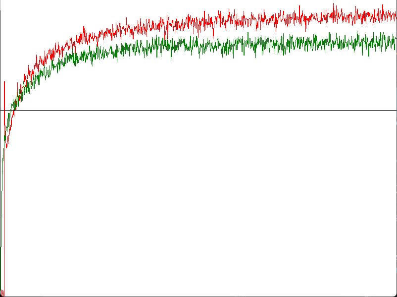

# UCB  
今回も同様にどうすれば別の手を選ぶことができるかを考える.  
今回は方策として、以下の式に従うように選ぶとする.  
```math
\begin{equation}
    \begin{split}
    A \dot{=} argmax \lbrack Q_t(a) + c \sqrt{\frac{\ln t}{N_t(a)}} \rbrack
    \end{split}
\end{equation}
```
もし右辺の第二項が0であればGreedy法と同じになる.  
となると大事なのは第二項の平方根となる.  
tは現在の試行回数,Nは現在までに何回試行したかとなる.  
つまりうまく試行回数を推定値に組み込んでいる状態となる.  
試行回数が多くても選ばれてなかったら、その手は選ばれやすくなるし.  
試行回数が多くて選ばれてる回数も多い場合は、分母も大きくなるので選ばれにくくなるといった具合.  
cはハイパーパラメータのようなもので、大きければ試行回数に左右されやすくなるし、小さければ左右されなくなる.  
これが上限信頼区間による行動選択である.  
実際にコードに組み込んでみよう.まず変数を用意する.  
```c++
	bool m_isUcb = false;
	double m_ucbParam = 0.0; // UCBの係数
```
そしたら実際の選択時に処理を行うかを分岐する.  
```c++
	int Action() const
	{
		double value = Random(0.0, 1.0);
		if (value < m_epsilon)
		{
			return Random(0, m_arm - 1);
		}

        // UCBを行う場合はこちらで処理
		if (m_isUcb)
		{
			return ActionUCB();
		}

        // ...
	}
```
もしUCBの場合は以下のような関数を書けばよい.  
```c++
	int ActionUCB() const
	{
		Array<double> ucbEstimates;
		for (int i = 0; i < m_estimates.size(); i++)
		{
			double ucbParam = m_estimates[i] +
				m_ucbParam * Sqrt(Log(m_stepCount + 1) / (m_actionCounts[i] + 1e-5));
			ucbEstimates.push_back(ucbParam);
		}

		double best = *std::max_element(ucbEstimates.begin(), ucbEstimates.end());
		Array<int> index;
		for (int count = 0; const auto & value : ucbEstimates)
		{
			if (best == value) { index.push_back(count); }
			count++;
		}

		// 一つ選ぶ
		return index.choice();
	}
```
式の計算をしてるのはここ、式そのままである.  
```c++
double ucbParam = m_estimates[i] +
    m_ucbParam * Sqrt(Log(m_stepCount + 1) / (m_actionCounts[i] + 1e-5));
```
計算をしたら後は最大値を選ぶだけなので、特に難しくない.  
さて、今回は平均報酬で結果を見てみよう.  
  
緑は$`\epsilon=0.1`$のEpsilon Greedy法,赤は$$`c=2`のUCBである.  
今回の場合UCBの方がよい性能となっている.  