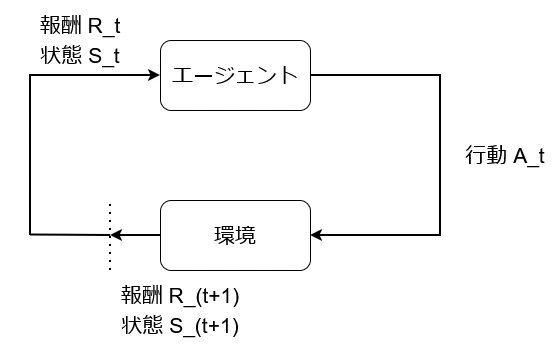
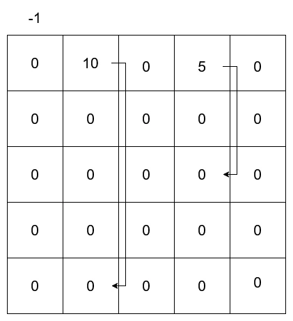
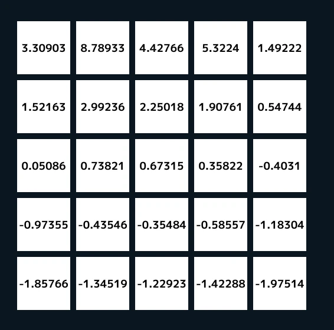

# BellmanEquation  
まずはベルマン方程式に入る前に有限マルコフ決定過程を見ていこう.  
  
これのやりたいことは非常に簡単である.  
エージェントが行動をすると、環境によって報酬と状態を得る.  
この得た報酬と状態をエージェントは学習し、次の行動に生かしていく、こういうモデルがマルコフ決定過程である.  
このループが有限なものが有限マルコフ過程となる.  
さてこれを上手く現したのがベルマン方程式、以下のような形.   
```math
\begin{equation}
    \begin{split}
    v_{\pi}(s) = \sum_{a} \pi (a|s) \sum_{s^{'},r} p(s^{'}, r|s,a)[r + \gamma v_{\pi}(s^{'})]
    \end{split}
\end{equation}
```
さて、これだけ見ても難しいので、今回はグリッドワールドという例題で解いていく.  
これはまず以下のような環境を考える.  
  
やることは簡単だ、グリッド上のどこかから移動するとしよう.  
グリッドの移動は上下左右のみとする.  
```c++
// 移動方向
enum class Direction { LEFT, UP, RIGHT, DOWN };
Array<Direction> actions = { Direction::LEFT, Direction::UP, Direction::RIGHT, Direction::DOWN };
auto GetMoveDirection = [](const Direction dir)
    {
        switch (dir)
        {
        case Direction::LEFT:	return Vec2i{ 0,-1 };
        case Direction::UP:		return Vec2i{ -1, 0 };
        case Direction::DOWN:	return Vec2i{ 1,0 };
        case Direction::RIGHT:	return Vec2i{ 0,1 };
        }
        return Vec2i{ 0,1 };
    };
```
そしてグリッドのサイズは5x5の25マスである.  
```c++
// Gridサイズ
constexpr int WORLD_SIZE = 5;
Array<double> worlds; worlds.resize(WORLD_SIZE * WORLD_SIZE, 0.0);
```
今回は1次配列で2次元を表すようにしておこう.  
移動をするだけであれば報酬としては$`R=0`$である.  
そしてグリッドを移動するので、グリッドを移動した後はそのグリッドの位置の状態になる,$`S_t \to S_{t+1}`$みたいな.  
この問題はそれだけではない,図を見ればわかる通り、とある位置に行った場合は$`R=10,R=5`$という報酬を得られることになる.  
その後の状態は基本的に遠くのグリッドに飛ばされることになる.  
まずはこの特殊な位置を定義しておく.  
```c++
using Vec2i = Vector2D<int>;

// Aの位置関係
constexpr Vec2i A_POS = { 1,0 };
constexpr Vec2i A_PRIME_POS = { 1,4 };

// Bの位置関係
constexpr Vec2i B_POS = { 3,0 };
constexpr Vec2i B_PRIME_POS = { 3,2 };
```
さて、そしたら今言った行動を実際に関数として書いてみる.  
```c++
auto Step = [&](const Vec2i& state, const Vec2i action)
{
    if (state == A_POS) { return std::tuple{ A_PRIME_POS, 10.0 }; }
    if (state == B_POS) { return std::tuple{ B_PRIME_POS, 5.0 }; }

    auto nextState = state + action;
    double reward = 0.0;
    if (nextState.x < 0 || WORLD_SIZE <= nextState.x ||
        nextState.y < 0 || WORLD_SIZE <= nextState.y)
    {
        // 範囲外は-1の報酬
        reward--;
        nextState = state; // 範囲外には移動しないように
    }
    return std::tuple{ nextState, reward };
};
```
まず次の行動は現在の位置である`state`と行動`action`の引数により実行される.  
まず特殊な位置`A_POS`,`B_POS`の場合は報酬10,5と飛ばされる位置`A_PRIME_POS`,`B_PRIME_POS`を返して終わりにする.  
```c++
if (state == A_POS) { return std::tuple{ A_PRIME_POS, 10.0 }; }
if (state == B_POS) { return std::tuple{ B_PRIME_POS, 5.0 }; }
```
tupleになっているが新しい位置と報酬を返してるだけである.  
そして次の位置を計算して報酬も初期化しておく,報酬は基本的に0.  
```c++
auto nextState = state + action;
double reward = 0.0;
```
今回の中で大事なのは範囲外に行った場合、この場合のみちょっと違った報酬になる.  
```c++
if (nextState.x < 0 || WORLD_SIZE <= nextState.x ||
    nextState.y < 0 || WORLD_SIZE <= nextState.y)
{
    // 範囲外は-1の報酬
    reward--;
    nextState = state; // 範囲外には移動しないように
}
```
範囲外に出てしまった場合は報酬は-1になり、位置は前までの位置に戻す.  
要は行動をするとしても、外に出ないようにする必要があるってことである.  
```c++
return std::tuple{ nextState, reward };
```
あとは行動さえしてしまえば終わりとなる.  
これで行動ができたので、次は実際にベルマン方程式の計算を行っていく. 
```c++ 
Array<double> newValues; newValues.resize(WORLD_SIZE * WORLD_SIZE, 0.0);

for (int i = 0; i < WORLD_SIZE; i++)
{
    for (int j = 0; j < WORLD_SIZE; j++)
    {
        for (const auto& action : actions)
        {
            auto [nextState, reward] = Step(Vec2i{ i,j }, GetMoveDirection(action));
            // ベルマン方程式
            newValues[i * WORLD_SIZE + j] += PROB * (reward + DISCOUNT * worlds[nextState.x * WORLD_SIZE + nextState.y]);
        }
    }
}
```
計算した値は`newValue`に入れるようにしておく.  
i,jはグリッド位置でactionは先ほど定義した上下左右の移動である.  
Stepの計算でActionを行い、実際に環境から結果を出力する.  
```c++
auto [nextState, reward] = Step(Vec2i{ i,j }, GetMoveDirection(action));
```
`nextState`が$`S_{t+1}`$で`reward`が$`R_{t+1}`$となる.  
さて、次が大事なベルマン方程式.  
```c++
// ベルマン方程式
newValues[i * WORLD_SIZE + j] += PROB * (reward + DISCOUNT * worlds[nextState.x * WORLD_SIZE + nextState.y]);
```
さて、ベルマン方程式ではまずどっちに行くかの確率がある.  
これが$`\pi (a|s)`$となるわけであるが、これは状態sの場合にaという行動をとる確率となる.  
これはaとして4方向あり、各方向が選ばれるのは均等なので0.25となる.  
```c++
constexpr double PROB = 0.25;
```
そして、次に$`p(s^{'},r|s,a)`$だが、これはある状態sである行動aをした際、状態$`s^{'}`$で報酬rを得る確率である.  
これは状態から行動した後はグリッドワールドの場合は1である.  
例えば上に移動した場合、上と斜め上の2パターンがあるわけでもないし、報酬も1つのみだから、別段分岐もないので1であるはずなわけだね.  
そして$`r+\gamma v_{\pi}(s^{'})`$だが、これもシンプル.  
rは報酬なのでそのまま、$`v_{\pi}`$は単純に新しく来た位置の価値、$`\gamma`$は割引率でどれくらい新しく来た位置を評価するかのハイパーパラメータである.  
今回は0.9にしておく.  
```c++
constexpr double DISCOUNT = 0.9;
```
こんな感じですべての移動とすべての移動後の状態の関係を表して、現在の状態の価値を表すのがベルマン方程式となる.  
すべての未来の状態とその後の行動すべてを足し合わせているので、それは結構重い.  
それに終わりのない計算の場合もあるため、極論どこかで打ち切る必要がある.  
今回は閾値を設けてある程度の変化がなくなった段階で終わりにするようにしよう.  
```c++
double sum = 0.0;
for (int i = 0; i < worlds.size(); i++)
{
    sum += Abs(worlds[i] - newValues[i]);
}
// 収束してるなら終了
if (sum < 1e-4) { break; }

// 現在のものに更新
worlds = newValues;
```
やってることは簡単である、新しい値が現状の値とどれくらい差があるかを見てる.  
差がある程度小さくなってれば終わり、なってないならさらに次の状態も計算するという具合である.  
こうしてグリッドワールドを何度も計算して、収束した値は次のようになる.  
  
報酬の貰える一番上の左から二つ目と四つ目のグリッドは評価値が高め.  
そして、それからどんどんと下に行くほど評価値が低くなる.  
これは当たり前だね、そして特に外側のグリッドは評価値が低め.  
これも外に出やすいグリッドなので評価は小さくなるのである.  
こんな感じで状態と行動そして報酬を上手く定義すれば、現在の状態の価値を計算できるのがベルマン方程式となる.  