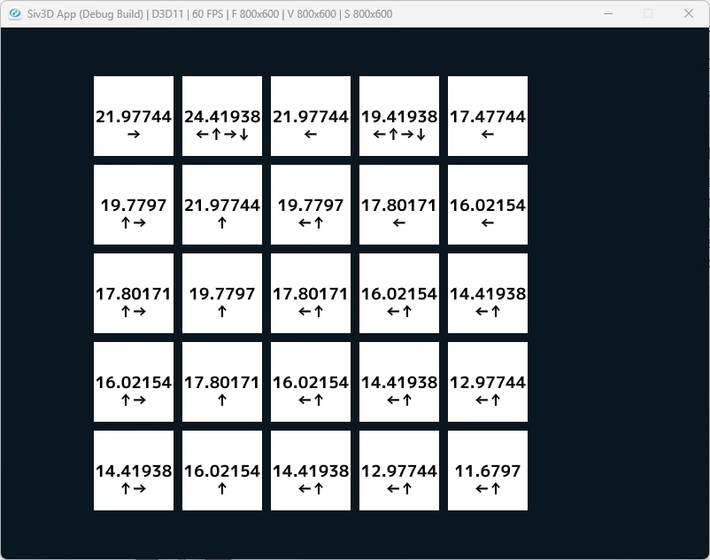

# BellmanOptimalityEquation  
次はベルマン最適方程式をやってみる.  
```math
\begin{equation}
    \begin{split}
    v_{*}(s) = max_{a} \sum_{s^{'},r} p(s^{'}, r|s,a)[r + \gamma v_{*}(s^{'})]
    \end{split}
\end{equation}
```
前回の式との違いは、和となっていたところがmaxとなっている部分である.  
$`\pi`$は言ってしまえば方策なので、方策のうち一番良いものを選ぶことで最適なものを選んでいるわけである.  
これ自体は実装としては非常に簡単で、前回のグリッドワールドにちょっと変更を加えるだけである.  
```c++
auto [nextState, reward] = Step(Vec2i{ i,j }, GetMoveDirection(action));
// ベルマン方程式
values.push_back(reward + DISCOUNT * worlds[nextState.x * WORLD_SIZE + nextState.y]);
```
まずはベルマン方程式を愚直に計算する.  
この時計算した結果を一旦保持しておく.  
```c++
newValues[i * WORLD_SIZE + j] = *std::max_element(values.begin(), values.end());
```
あとは最大値をとればよいだけ、これがmaxの処理に相当.  
これをまとめて書くと以下のようになる.  
```c++
Array<double> values;
for (const auto& action : actions)
{
    auto [nextState, reward] = Step(Vec2i{ i,j }, GetMoveDirection(action));
    // ベルマン方程式
    values.push_back(reward + DISCOUNT * worlds[nextState.x * WORLD_SIZE + nextState.y]);
}

newValues[i * WORLD_SIZE + j] = *std::max_element(values.begin(), values.end());
```
さて、前回は可視化として$`v`$のみであったが、今回は$'\pi'$の方も可視化してみよう.  
これの目的は、$`\pi`$の中で一番良い方策を可視化することである.  
まずは周囲の数値を計算していく.  
```c++
```c++
// 周囲の数値を計算
Array<std::tuple<double, Direction>> nextValues;
for (const auto& action : actions)
{
    auto [nextState, reward] = Step(Vec2i{ i,j }, GetMoveDirection(action));
    if (reward == -1) { continue; } // 範囲外を省いておく
    nextValues.push_back({ worlds[nextState.x * WORLD_SIZE + nextState.y], action });
}
```
これは次の行動をした時の値を保持するだけ.  
更に言うと、外側に出るような移動の場合は省略しておく.  
```c++
// 最大値を取る
std::tuple<double, Direction> maxValue = *std::max_element(
    nextValues.begin(), nextValues.end(),
    [](const std::tuple<double, Direction>& a, const std::tuple<double, Direction>& b) {
        return std::get<0>(a) < std::get<0>(b);
    });
```
次に最大の値を取る.  
最大の値となる場合は最適な方向なので、これで最適な$`\pi`$が見つかることになる.  
```c++
// 最大値に近い方向を取得
String arrow;
for (auto& value : nextValues)
{
    if (std::get<0>(maxValue) - std::get<0>(value) < 1e-16)
    {
        arrow += GetMoveFigs(std::get<1>(value));
    }
}
```
あとは最大値の方向を決定するだけ.  
ただし最大の方向は複数存在する可能性があるので、見つかった最大値と比較して、ある程度近ければそれが最適な方向となる.  
これをまとめれば以下のようになる.  
```c++
// 周囲の数値を計算
Array<std::tuple<double, Direction>> nextValues;
for (const auto& action : actions)
{
    auto [nextState, reward] = Step(Vec2i{ i,j }, GetMoveDirection(action));
    if (reward == -1) { continue; } // 範囲外を省いておく
    nextValues.push_back({ worlds[nextState.x * WORLD_SIZE + nextState.y], action });
}

// 最大値を取る
std::tuple<double, Direction> maxValue = *std::max_element(
    nextValues.begin(), nextValues.end(),
    [](const std::tuple<double, Direction>& a, const std::tuple<double, Direction>& b) {
        return std::get<0>(a) < std::get<0>(b);
    });

// 最大値に近い方向を取得
String arrow;
for (auto& value : nextValues)
{
    if (std::get<0>(maxValue) - std::get<0>(value) < 1e-16)
    {
        arrow += GetMoveFigs(std::get<1>(value));
    }
}
```
実際に実行した結果は以下のような感じ.  
  
矢印の方向が最適な方向.  
基本的に最大の方向に向かっているのが分かる.  
これで三章の内容は終わり！  