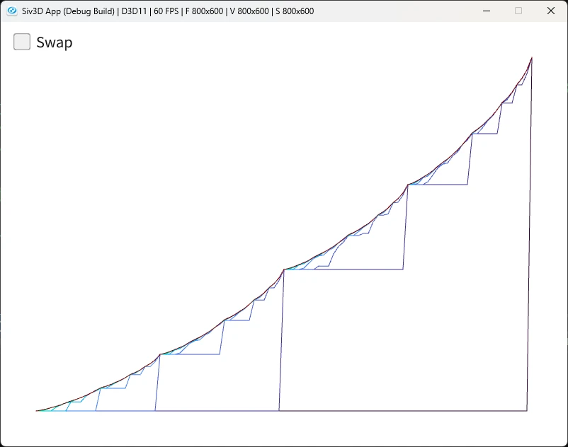
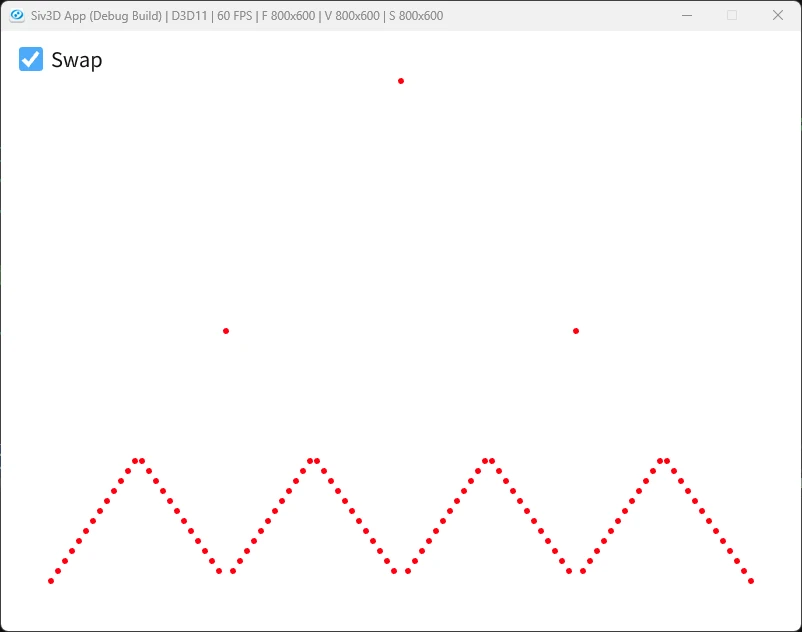

# Gambler Problem  
前回は方策反復をやった.  
こいつの欠点は反復毎に方策評価が必要であり、この方策評価も結構重い点である.  
前回のJacks Car Rentalの評価を見ればわかる通り、方策が安定してるのかの計算は結構馬鹿にはならない.  
そこで完全に評価がOKになるまで回すのではなく、途中で止めてもよかったりしない？というのが今回の`価値反復`という考えの起点.  
ではどう打ち切るかだけど、まずは一番簡単な方法として、方策評価を1回のみで打ち切る方法が考えらえれる.  
要は今まで方策評価->方策改善->方策評価->方策改善->...となってたところを方策評価->方策改善(決定)で終わらせてしまうわけである.本当に一度だけである.  
一応式にしてしまえば以下のような感じ.  
```math
\begin{equation}
    \begin{split}
    v_{k+1}(s) = max_{a} \sum_{s^{'},r} p(s^{'}, r|s,a)[r + \gamma v_{k}(s^{'})]
    \end{split}
\end{equation}
```
全ての行動に対して計算をして、その中で一番良い手を選んで次につなげる、これをするだけだ.  
今回はギャンブラー問題を基にこの一度だけで済ませる`価値反復`を解いてみよう.  
やることは簡単で、コインを投げて掛け金を競うゲームだ.  
投げたらコインなので、表裏が出る.  
そして、ギャンブルなのでもちろんお金を掛ける.  
掛けたお金は表裏によって、損得が決まる.これは以下の感じ.  

* 表: 掛けた額と同じ額が入る
* 裏: 掛けた額と同じ額失う

今回は1ドル単位で掛けることができるとし、100ドル稼げれば勝利、0ドルになったら負けで終了とする.  
まずはこの100ドルを定義しておく.  
```c++
	constexpr int GOAL = 100;
```
次にあり得る状態、これは終了してしまう0と100を除いた状態なので、$`s \in \{1,2, ..., 99\}`$となる.  
これをコードで表すと以下のようになる.  
```c++
	Array<int> states;
	for (int value = 1; value < GOAL; value++)
	{
		states.push_back(value);
	}
```
さて、どんな確率でもいいけども、本に合わせて表になる確率は0.4にする.  
```c++
constexpr double HEAD_PROBABILITY = 0.4;
```
さて、そして今回の報酬だがギャンブラーは勝てれば+1の報酬を得るようにする.  
つまり、100ドルを稼げたときのみ+1でそれ以外は0になるようにすればよい.  
```c++
	// [0,100]を生成
	Array<double> values; values.resize(GOAL + 1, 0.0);
	// 100のみ+1にしておく
	values[GOAL] = 1.0;
```
そしたら次に実際に方策評価をしていく.これはいつも通りの流れだけど、まずは古い値を保持しておく.  
```c++
	while (true)
	{
		Array<double> oldValues = values;

		//...
	}
```
そしたら全状態で評価を行っていく.  
```c++
	for (auto& state : states)
	{
		// ...
	}
```
次に今掛けられる掛け金を定義する.  
これは持っているお金を$`s`$ドルとすると、掛け金は$`min(s, 100-s)`$となる.  
なんでこうなってるかは50という境界を考えるとわかりやすい.  
50ドル未満はどれだけ賭けても100ドルには到達できない.  
最大である49ドル賭けて勝っても、98ドルになるだけである.  
なので、そのまま1~49ドルを掛ければよい.  
逆に50ドル以上は100ドルに到達可能になる.  
例えば75ドル持ってるとすれば、25ドル賭ければすでに勝ちとなる.  
であれば、25ドル以上かけるのは無駄であることが分かるので、$`100-s`$といった感じで状態を制限してると考えれば分かりやすいかもしれない.  
さて、この状態は以下のようにすれば定義できる.簡単だね.  
```c++
	Array<int> actions;
	// stateは現在の状態=今持ってるドル:sのこと
	int minAction = Min(state, GOAL - state);
	for (int value = 1; value <= minAction; value++)
	{
		actions.push_back(value);
	}
```
行える行動を取ったら実際に評価を行う.  
0.4の確率で表が出るので、表の場合を確率とその際の報酬で計算.  
```c++
double left = HEAD_PROBABILITY * values[state + action];
```
逆に0.6の確率で裏が出るので、表の場合と同様に計算.  
ドルが減る方向なので、こっちアstateからマイナスにしてるね.  
```c++
double right = (1.0 - HEAD_PROBABILITY) * values[state - action];
```
この結果を足し合わせたものを評価として保存しておく.  
ここまでをまとめると以下のようになる.  
```c++
Array<double> returns;
for (auto& action : actions)
{
	double left = HEAD_PROBABILITY * values[state + action];
	double right = (1.0 - HEAD_PROBABILITY) * values[state - action];
	double result = left + right;
	returns.push_back(result);
}
```
最後にこの値の中で最大となるものを選ぶ.  
```c++
// 良い値で更新
double newValue = *std::max_element(returns.begin(), returns.end());
values[state] = newValue;
```
ここまで出来たらいつも通り収束しているかの判断を行う.  
```c++
double maxValue = std::numeric_limits<double>::lowest();
for (int i = 0; i < values.size(); i++)
{
	maxValue = Max(maxValue, Abs(oldValues[i] - values[i]));
}

// 収束と判断したら終了
if (maxValue < 1e-9)
{
	histories.push_back(values);
	break;
}
```
最後に方策改善と同様のことを行う.  
前回はこの方策改善ではちゃんと収束しているかを判定したが、今回は価値改善の通り反復を打ち切ってしまう.  
なので、最大のものを取って終わりとなる.  
最初にやることは簡単で、最大の値を取るまではさっきと同じである.  
```c++
Array<double> policies; policies.resize(GOAL + 1, 0.0);
for (auto& state : states)
{
	if (state == GOAL) { continue; }
	// 可能な行動を生成
	Array<int> actions;
	int minAction = Min(state, GOAL - state);
	for (int value = 1; value <= minAction; value++)
	{
		actions.push_back(value);
	}

	// 評価
	Array<double> returns;
	for (auto& action : actions)
	{
		double left = HEAD_PROBABILITY * values[state + action];
		double right = (1.0 - HEAD_PROBABILITY) * values[state - action];
		double result = left + right;
		returns.push_back(result);
	}

	// ...
}
```
そしたら最大値の選択をする際にちょっと調整を行う.  
これはここで[議論されてる](https://github.com/ShangtongZhang/reinforcement-learning-an-introduction/issues/83)のが分かりやすい.  
ここでは0を省く処理をしているが、今回はactionの生成時に0は除いてるので大丈夫.  
そもそも元コードは0も計算に入れてるけど、0は何も賭けないということになるのでそもそも賭けになってない.  
ブラックジャックとかならまあ降りるとかも考えられるけど、コイントスで表裏どっち！？で賭けないというのもちょっとおかしくはあるので、今回は省いてる.  
そしてRound処理.  
これがやりたいのは同点の場合が評価がおかしくなることがある.  
そもそも得られる結果は整数のはずだけど、小数で計算をしてるため、場合によっては同点なのに差が出る可能性がある.  
そのため、丸め込みを行って同点として比較を行うことで、配列内の最小のものが確実に選ばれるようになるわけである.  
基本的に最小の配列内探索は同じ値があれば、配列の小さい方が選択されるのでこれは言えるはず.`std::max_element`もそうなはず.  
```c++
auto RoundN = [](double value, int n)
	{
		double p = Pow(10, n);
		return Round(value * p) / p;
	};

std::for_each(returns.begin(), returns.end(), [&](double& value) { value = RoundN(value, 5); });
auto maxElement = std::max_element(returns.begin(), returns.end());
auto distance = std::distance(returns.begin(), maxElement);
policies[state] = actions[distance];
```
これで用意は完了!!  
今回は2つのグラフを出力して、結果を比較してみよう.  
  
これは横軸が所持金で、縦軸が価値を表している.  
価値は1が最大で、0が最小となる.  
そして一番左側の図が初期状態となる.  
最初にデータを構築したときには、100ドルのときのみ1の価値を出していたので、最後に一気に跳ねてるのは正しい.  
そして大まかな形の折れ線となる.  
50ドル付近で一回価値が上がって、次に75ドル近くで上がって、87ドルくらいで上がって...みたいな感じで階段状となる.  
まあ一回目だと50ドルより下はそもそも100ドルに到達しないので、100ドルに存在する1が伝搬しない.  
なので、50ドルより下が0なのは正しい.  
この階段状が次の処理で更に滑らかになり、その次の処理で滑らかになってというのを繰り返して、最後の安定時は見た目上は滑らかになっている.  
価値に関しては持ってるドルが少ない場合は100ドルに到達しにくいので、価値が低く、100ドルに近いほど勝利しやすいので価値も高い.  
  
次のものは横軸が所持金で、縦軸は最終方策、要は持ってるドルに対する掛け金となる.  
結構奇妙で25ドル,50ドル,75ドルで大きく賭けて戦ってるのが分かる.  
そもそも確率は0.4で表、つまり続けば続くほど負けが込む設定となってる.  
なので、できるだけ早くゴールを目指すのが方策となる.  
勝てるときに一気に勝負してるわけだ、なので25ドルの時は一気に50ドルに飛ぼうとするし、50ドルなら一気に勝てるように勝負してじり貧になる前に決着を付けに行く.  
とはいえ51ドルの場合は賭けてるのは1ドル.奇妙だね、49ドル賭ける方が合理的に思える.  
これは[ここ](https://www.reddit.com/r/reinforcementlearning/comments/cr4ym2/question_exercise_48_sutton_bartos_book/?tl=ja)の説明が非常に分かりやすかった.  
要は51ドルであれば、1ドル分の猶予がある.  
この1ドルでどれだけ稼げるかを試すのである.  
もし成功すれば資金は増えてくし、負ければまだ一発逆転があり得るので、50ドル賭けてしまえばよい.  
そんな感じの理解が丁度良さそうかなぁとは思う.  
これで4章も終了だね.  