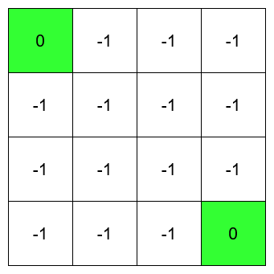
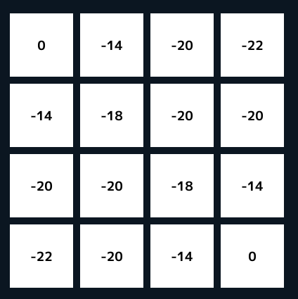

# PolicyEvaluation  
四章は方策評価から始めていこう.  
今までやってきたベルマン方程式というのは以下の式を解くことだった.  
```math
\begin{equation}
    \begin{split}
    v_{\pi}(s) = \sum_{a} \pi (a|s) \sum_{s^{'},r} p(s^{'}, r|s,a)[r + \gamma v_{\pi}(s^{'})]
    \end{split}
\end{equation}
```
これでは全部のパターンを計算する必要があり、計算量が多いのは明らかである.  
全部の問題に適用できるわけではないけども、ものによっては反復処理を行うことによって簡単に解決することができる場合もある.  
この反復処理を式にするとこんな感じ.  
```math
\begin{equation}
    \begin{split}
    v_{k+1}(s) = \sum_{a} \pi (a|s) \sum_{s^{'},r} p(s^{'}, r|s,a)[r + \gamma v_{k}(s^{'})]
    \end{split}
\end{equation}
```
計算した$`v_k`$を使って次の$`v_{k+1}`$を計算する.  
シンプルだけど簡単な処理、要は今までは全パターンを計算していたところを都度上書き更新することで短縮をしようという感じ.  
この本ではこの上書き更新をDPとしている.まあ確かにDPっぽい.  
これを実際に確認するために、今回は次のようなグリッドワールドを考えてみる.  
  
一番端の緑色の部分にたどり着けば0、それ以外に移動を行った場合は-1の報酬となる.  
また、緑の部分にたどり着いた場合はそれ以降移動はできない状態.  
今回はこんな感じでこの状態を定義してみた.  
```c++
auto IsTerminal = [&](const Vec2i& state)
    {
        int maxSize = WORLD_SIZE - 1;
        bool isLeftSection = state.x == 0 && state.y == 0;
        bool isRightSection = state.x == maxSize && state.y == maxSize;

        return isLeftSection || isRightSection;
    };
```
まず緑の位置かどうかを判定するコードを用意.  
leftが左上,rightが右下となる.  
```c++
auto Step = [&](const Vec2i& state, const Vec2i action)
    {
        if (IsTerminal(state))
        {
            return std::tuple{ state, 0 };
        }

        auto nextState = state + action;
        if (nextState.x < 0 || WORLD_SIZE <= nextState.x ||
            nextState.y < 0 || WORLD_SIZE <= nextState.y)
        {
            nextState = state; // 範囲外には移動しないように
        }

        // 基本的に行動は-1の評価
        return std::tuple{ nextState, -1 };
    };
```
後は今までのグリッドワールドと同じように行動を定義してあげればOK.  
停止位置の場合は移動せずに0の報酬、それ以外は-1の報酬で外に出ないようにするだけ.  
そして、あとは実際に計算するだけ.  
DPの場合の違いを見ていきましょうか.  
```c++
// 前回
for (int i = 0; i < WORLD_SIZE; i++)
{
    for (int j = 0; j < WORLD_SIZE; j++)
    {
        for (const auto& action : actions)
        {
            auto [nextState, reward] = Step(Vec2i{ i,j }, GetMoveDirection(action));
            // ベルマン方程式
            newValues[i * WORLD_SIZE + j] += PROB * (reward + DISCOUNT * worlds[nextState.x * WORLD_SIZE + nextState.y]);
        }
    }
}

// 今回
for (int i = 0; i < WORLD_SIZE; i++)
{
    for (int j = 0; j < WORLD_SIZE; j++)
    {
        double value = 0.0;
        for (const auto& action : actions)
        {
            auto [nextState, reward] = Step(Vec2i{ i,j }, GetMoveDirection(action));
            // ベルマン方程式
            value += PROB * (reward + DISCOUNT * worlds[nextState.x * WORLD_SIZE + nextState.y]);
        }

        worlds[i * WORLD_SIZE + j] = value;
    }
}
```
今までは`newValues`というものに保存して、その後に一気に`worlds`を更新という手を取っていた.  
今回は`worlds`を順次更新している.これが先ほど言った上書き更新であり、DPと言われている部分である.  
この計算を実際に行った結果が以下のような感じ.  
  
左下と右上の場合は0、それはそう.  
そして、停止位置に行くまで移動が必要なものは負の値になっている.  
この負の値は停止位置から遠いほど数値が大きい.  
この距離というのはマンハッタン距離として考えればよい.  
例えば中心4つは-18か-20となっているが、-18の方はマンハッタン距離として考えれば2だが、-20の場合はマンハッタン距離よして考えると3である.  
また外側に行きやすいとその分評価は低くなる.  
これは右上と左下が顕著で、マンハッタン距離は3だが、外に出やすい分-22となってるものかと思う.  
ということでDPは上書き更新、とりあえずこれだけは押さえたい所.  