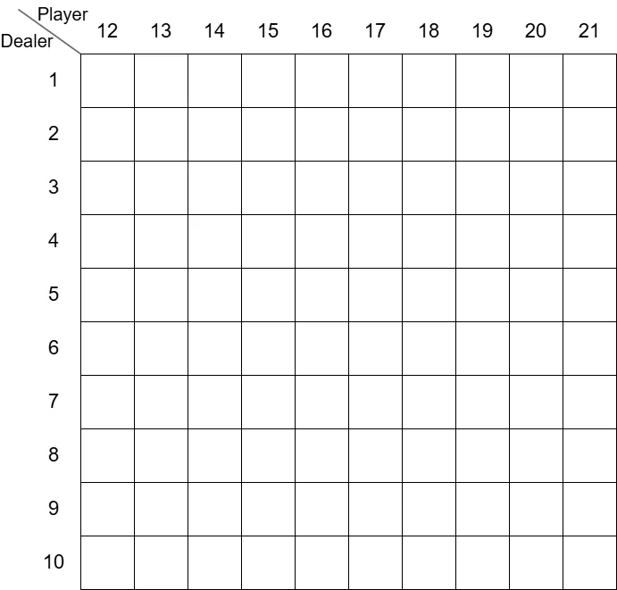
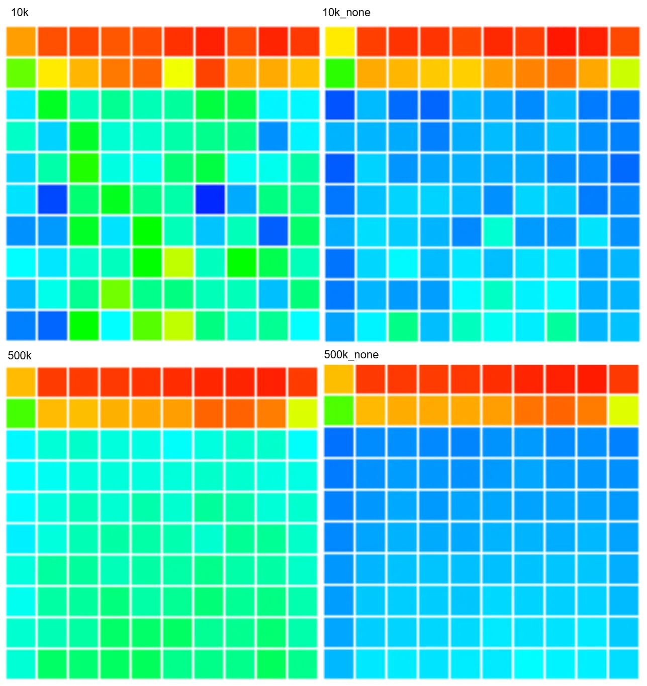

# first-visit MC: 初回訪問MC  
さて、今回からMonte Carlo法をやってく.  
Monte Carloといえば価値の推定を行う際に、行動を行い観測した報酬を平均化してあげれば期待値に収束しそうというのが元.  

CGだとモンテカルロ法を使って上手い感じにレイトレしてるよね.  
大量にランダムなrayを飛ばして平均することで期待値に収束していく、感覚としてはこれに近い感じ.  
他にも円に点を打ちこんで円周率を計算するのなんかも有名だね.  
こっちの方が知ってる人が多いかも、円を四角で囲んで円の中に入れば加算して打った合計を平均化させることで円周率が計算できちゃう.  

感覚としてこれを強化学習でも取り入れようというのが今回の道筋.  
さて、その中でも今回やるのは`first-visit MC`、初回訪問MC.  
初回訪問MCというのは簡単に言ってしまえば、一連の流れの内で最初の時の報酬のみを考慮するもの.  
逆に一連の流れで複数回訪れても初回しか反映されないというもので、これを複数回訪れたものも考慮するのが`every-visit MC`、逐一訪問MCと呼ぶらしい.  

例として前回のギャンブラー問題なんかが分かりやすいのかも.  
ギャンブラー問題ではコイントスをして100ドルに達するか0ドルになるかで終了していた.  
このとき50ドル→51ドル→50ドル→100ドルという辿り方をした場合を考えてみよう.  
この時に50ドルx2,51ドルx1,100ドルx1という辿り方をしている.  
しかし,first-visitの場合は初回の50ドルの報酬のみを考慮して、2回目の方はスキップしてしまう.  
これに対してevery-visitの場合は2回とも報酬をを記録して蓄積しておき、平均化して足し合わせるという風に2回目もちゃんと考慮するようになる.  
自分はこんな感じで解釈をしてみた、なんとなく正しそう.  

この`first-visit MC`を今回はブラックジャックを例に実際にやってみる.  
ブラックジャックのルールは知ってる人も多いだろうし、調べればある程度出てくるので省略する.  
ブラックジャックで試す利点は特に特別な処理をしなくても、勝手に`first-visit`になる点にある.  
持ち手の点数が減ることはありえないからね、常に21を目指して足していくだけ.  
ということで兎にも角にもまずはゲームを試行できないと意味がないので、これを作っていく.  

まず最初はポーカーの行動の定義から.  
今回はチップとかそういうのは考えずに、勝ちか負けかの二択.  
なので、foldもなしでhitかstandかのみを定義しておく.  
```c++
enum class Action
{
    Hit = 0,	// ヒット
    Stand = 1	// スタンド
};
const Array<Action> actions = { Action::Hit, Action::Stand };
```

次に行動指針,Policyってやつ.  
どんな行動指針でもいいけど、今回は本に書いてあるPolicyに合わせる.  
プレイヤーの行動指針は簡単で、まず12\~19の範囲はヒットし続ける.  
20以上はスタンドしてしまうという寸法.  
```c++
	// Playerの行動ポリシー
	Array<Action> playerPolicy; playerPolicy.resize(22, Action::Hit);
	// [12,19]の場合はヒット,[20,21]はスタンド
	for (int i = 12; i < 20; i++) { playerPolicy[i] = Action::Hit; }
	playerPolicy[20] = Action::Stand; playerPolicy[21] = Action::Stand;
	auto PolicyPlayer = [&](int playerSum) { return playerPolicy[playerSum]; };
```
ディーラーは単純でルール通り17以上になるまではヒットして、それ以降はスタンドという内容.  
```c++
	Array<Action> dealerPolicy; dealerPolicy.resize(22, Action::Hit);
	// [12,16]の場合はヒット,[17,21]はスタンド
	for (int i = 12; i < 17; i++) { dealerPolicy[i] = Action::Hit; }
	for (int i = 17; i < 22; i++) { dealerPolicy[i] = Action::Stand; }
	auto PolicyDealer = [&](int dealerSum) {return dealerPolicy[dealerSum]; };
```

そしたらちょっとした便利関数.  
まず最初はカードを引く関数.  
J,Q,Kは10とおなじなので、min関数で10より大きくならないようにしている.  
```c++
auto GetCard = []()
    {
        int card = Random<int>(1, 13); // [1,2,...,J,Q,K]
        return Min(card, 10); // J,Q,Kは10と同じ
    };
```
そして、Aceを引いたときに11に強制的にする関数.  
これを通せば1は強制的に11になる.  
```c++
	auto CardValue = [](int value) { return value == 1 ? 11 : value; };
```

次に今回のカードの行動手順はTrajectoryとして記録を行う.  
```c++
struct Trajectory
{
    bool m_isPlayerUseAceEleven;
    int m_playerSum;
    int m_dealerCardFirst;
    Action m_action;
};
```
入れてるデータは以下の4つ.  

* playerはAceを11として使っているか
* プレイヤーの得点の合計
* ディーラーの1枚目のカード
* 行動

これを記録するようにする.  
Play関数で試行を行うが、このTrajectoryと報酬が返ってくるので、この値を使って評価を行うことになる.  
```c++
	auto Play = [&](Array<Trajectory>& trajectories, int& reward)
    {
        // ...
    };
```

それではPlayの中身を見ていこう.  
まずはプレイヤーとディーラーで必要なパラメータを用意.  
```c++
// プレイヤー側
int playerSum = 0; // プレイヤーの合計点
bool isPlayerUseAceEleven = false; // Aceを11として使う？

// ディーラー側
int dealerSum = 0; // ディーラーの得点
int dealerCardFirst = 0; // 1枚目
int dealerCardSecond = 0; // 2枚目
bool isDealerUseAceEleven = false; // Aceを11として使う？
```
まずはプレイヤー側の得点調整.  
12点を越えてないならとりあえずカードを引き続ける.  
もしAceを引いた場合は11を持っているというフラグを立てる.  
基本的にAceは11として使うが、プレイヤー合計が21を越えちゃうときは1として使えるように-10する.  
これが起きるのは現在の合計が11の時にAceを引いたときのみだね.  
```c++
// 行動ポリシー範囲内までカードを引く
while (playerSum < 12)
{
    int card = GetCard();
    playerSum += CardValue(card);

    if (playerSum > 21)
    {
        // 手持ちが11の時にAceを引いた場合,22になる可能性あり
        // この場合は1として換算するために10を引いておく
        playerSum -= 10;
    }
    else
    {
        // Aceを引いてたら持ってるものに換算
        isPlayerUseAceEleven |= (card == 1);
    }
}
```
次にディーラー側の得点調整.  
カードを2枚引いて、得点に追加するだけ.  
また、1があった場合は1を持ってますよのフラグを立てる.  
ただし、2枚ともAceだった場合、`CardValue`の強制11の処理で22となりバーストしてしまう.  
そのため、dealerSumが22の時は-10して、片方は1として扱うようにしておく.  
```c++
dealerCardFirst = GetCard(); dealerCardSecond = GetCard();
dealerSum = CardValue(dealerCardFirst) + CardValue(dealerCardSecond);
isDealerUseAceEleven = Array<int>{ dealerCardFirst, dealerCardSecond }.contains(1); // 1があればAce確定
if (dealerSum >= 22)
{
    // 2枚ともAceの場合のみ22になるので、1の方を採用する
    dealerSum -= 10;
}
```

ここまで来れば準備が整ったので、実際にゲーム開始！  
まずはプレイヤーのターンから構築していく.  
以下の処理を繰り返して、条件を満たすまで続ける.  
まず現在の点から行動ポリシーを決定する.  
```c++
while (true)
{
    // 行動を決定
    Action action = PolicyPlayer(playerSum);

    // ...
}
```
そして、現在の状態を保存しておく.  
```c++
    // 状態を保存
    Trajectory trajectory;
    trajectory.m_isPlayerUseAceEleven = isPlayerUseAceEleven;
    trajectory.m_playerSum = playerSum;
    trajectory.m_dealerCardFirst = dealerCardFirst;
    trajectory.m_action = action;
    trajectories.push_back(trajectory);
```
状態がスタンドならプレイヤーのターン終了.  
ヒットならカードを追加して得点に点を足しておく.  
また、引いたカードがAceかを見つつ、Aceの数を数えておく.  
```c++
    // スタンドしてるなら手が決定
    if (action == Action::Stand) { break; }

    // ヒット、カードを追加
    int card = GetCard();
    playerSum += CardValue(card);

    // エース周りの特殊処理
    int aceCount = static_cast<int>(isPlayerUseAceEleven);
    aceCount += card == 1 ? 1 : 0; // 引いたカードがAceなら+1しておく
```
もしバーストしてる場合、Aceを持ってるなら-10して11として扱わないようにしておく.  
```c++
    while (playerSum > 21 && aceCount > 0)
    {
        // バーストしてる + Aceを持ってる場合,Aceを11から1に変える
        playerSum -= 10;
        aceCount--;
    }
```
Aceを変えてもバーストしちゃってる場合は負け、-1の報酬に設定して終了する.  
```c++
    if (playerSum > 21)
    {
        // バーストしてるなら終了
        reward = -1;
        return;
    }
```
そして、Aceの数が1かどうかでAceを11として扱ってるかのフラグを制御する.  
これが0なら全部1として扱ってるし、2とかになることはそもそもない.  
2になったら$`11x2=22`$でバーストしてるので.  
```c++
    // Aceを11で持ってるか(2枚はない、足したら22になるので)
    isPlayerUseAceEleven = (aceCount == 1);
```

次はディーラーの番.  
これはほぼPlayerと同じ処理.面倒なので共通化はしてない.パワープレイ.  
違いは行動ポリシーが`PolicyDealer`になってる点とバースト終了時の報酬が+1になってるくらい.  
あとTrajectoryの記録は別段しない点くらい.  
```c++
while (true)
{
    Action action = PolicyDealer(dealerSum);

    // スタンドしてるなら手が決定
    if (action == Action::Stand) { break; }

    // ヒット、カードを追加
    int card = GetCard();
    dealerSum += CardValue(card);

    // エース周りの特殊処理
    int aceCount = static_cast<int>(isDealerUseAceEleven);
    aceCount += card == 1 ? 1 : 0; // 引いたカードがAceなら+1しておく

    while (dealerSum > 21 && aceCount > 0)
    {
        // バーストしてる + Aceを持ってる場合,Aceを11から1に変える
        dealerSum -= 10;
        aceCount--;
    }

    if (dealerSum > 21)
    {
        // バーストしてるなら終了
        reward = +1;
        return;
    }

    // Aceを11で持ってるか(2枚はない、足したら22になるので)
    isDealerUseAceEleven = (aceCount == 1);
}
```
最後に勝敗を決めて終わり.  
勝ちなら1,負けなら-1,引き分けなら0とするだけ.  
```c++
// 勝敗
if (playerSum > dealerSum) { reward = 1; return; } // 勝ち
if (playerSum == dealerSum) { reward = 0; return; } // 引き分け
reward = -1; return; // 負け
```

さて、これでブラックジャックを試行できるになった.  
Playさえ呼び出せば、勝手に1回ブラックジャックが行われることになる.  
これを使って`first-visit MC`を計算していこう.  
これは`MonteCarloOnPolicy`という関数で行い、`episodes`で試行回数が決定できる.  
```c++
auto MonteCarloOnPolicy = [&](int episodes)
{
    // ...
};
```
まずは状態を定義する.これは100個のデータで用意する.  
```c++
Array<double> aceHaveStates(100, 0.0), aceHaveCount(100, 1.0);
Array<double> aceNoHaveStates(100, 0.0), aceNoHaveCount(100, 1.0);
```
StateはAceを持ってるか持ってないかの状態の2つ、これは0で初期化しておく.  
カウントはその状態を何回評価したかの値を保持する.これは割り算を行う際に使う.  
割り算ということは0除算はやりたくない、ということで1で初期化する.  

さて、そしたらなんで100個のデータを用意してるの？となると思う.  
これはプレイヤーの得点の合計とディーラーの1枚目のカードの状態を表したものである.  
プレイヤーの得点で`trajectory`が取れる値は12\~21である.  
これより小さい値はそもそも記録してないし,22以上はそもそもバーストなので記録されない.  
そしてディーラーの1枚目のカードは1\~10の値のどれかである.  
とりあえず1に関しては11とは扱わず、あくまで1として扱う.  
プレイヤーの状態数は10で、ディーラーの状態数は10,こうするとパターンとして10x10=100となるわけである.  
図で表すと以下のような二次元配列となる.  
  
見た目としては二次元配列のように考えるとわかりやすいが、扱いにくいのでコード内では単純に1次元で表してるだけ.  

そしたら次は実際に`episodes`で指定した回数試行を行う.  
まずはブラックジャックを1度行う.  
```c++
for (int i = 0; i < episodes; i++)
{
    // ブラックジャックを1回プレイ
    int reward = 0; Array<Trajectory> trajectories;
    Play(trajectories, reward);

    // ...
}
```
これでプレイした際の`trajectory`が得られるので、このパラメータを使って評価を行う.  
まずはプレイヤーの合計値とディーラーの1枚目のカードを取る.  
```c++
    for (const auto& trajectory : trajectories)
    {
        int playerSum = trajectory.m_playerSum;
        int dealerCard = trajectory.m_dealerCardFirst;

        // ...
    }
```
これを配列内の値に収めるために、0\~9の値に収める.  
```c++
        // [12,21] -> [0,9]に変換
        playerSum -= 12;
        // [1, 10] -> [0,9]に変換
        dealerCard--;
```
あとはプレイヤーがAceを11として扱ってるかで配列を決定し、報酬と試行回数を加算しておけばOK.  
```c++
        // Aceによって配列を取得
        auto& states = trajectory.m_isPlayerUseAceEleven ? aceHaveStates : aceNoHaveStates;
        auto& counts = trajectory.m_isPlayerUseAceEleven ? aceHaveCount : aceNoHaveCount;

        states[playerSum * 10 + dealerCard] += reward; // 報酬を加算
        counts[playerSum * 10 + dealerCard] += 1.0; // Aceを11として利用した回数を加算
```

ここまで出来たら最後に試行回数で割って、平均の値になるように調整を行う.  
Aceを持ってる状態と持っていない状態をまとめて返せば終了.  
```c++
		// 平均にしておく
		for (int i = 0; i < aceHaveCount.size(); ++i)
		{
			aceHaveStates[i] /= aceHaveCount[i];
			aceNoHaveStates[i] /= aceNoHaveCount[i];
		}

		return std::make_pair(aceHaveStates, aceNoHaveStates);
```

これで実際の処理が終わったので、実際に呼び出しを行ってみる.  
```c++
	auto trial10k = MonteCarloOnPolicy(10000);
	auto trial500k = MonteCarloOnPolicy(500000);
```

さて、最後にこれを可視化した結果を見てみよう.  
  
10,000回試行と500,000回試行した場合のAceがある場合とない場合の比較である.  
横軸がディーラーの1枚目の値で、縦軸がプレイヤーの合計点.そして、右と上が数値が大きい状態となる.  
また、赤の部分が報酬が高く、青の方が得点が低い.青なんかは負の状態になってるはず.    

まず10,000回よりも500,000回の方が安定してるのは見ればわかる感じである.  
また、Aceがない場合の方が安定感のある結果になってるのは、色の変化からも見て取れる.  
Acegaある場合は色の差が激しく、500,000回でもでこぼこした感じになってるね.  

ここからは練習問題5.1の個人的な回答.  
20,21がプレイヤーの点数の時に高いのは当たり前で勝ちやすい得点となる理由.  
19からはなんで低いのかというと、戦略としてこの場合にヒットしてるからであると思う.  
19だったらOKなのは1,2の2つのみ.これは$`\frac{2}{13}`$なので、まあほぼ失敗して終わる.  
とはいえ、ヒットが通る確率が半分を超える$`\frac{7}{13}`$とかは14である.  
相手は17まではhitしてくるためここでスタンドするのもう～んというかんじではある.中々ポリシー決めるのは難しいですね.  
まあそういう訳で20,21とそれ未満では壁がある訳である.負けやすいってことですね.  

さらにディーラーがAの場合は落ち込んでる理由、これは単純に11が作用することが多々あるからな気はする.  
要はあいこになる確率が高いので、ここだけ評価が低くなるわけである.  

といったところで今回はここまでかな.  