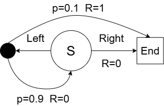
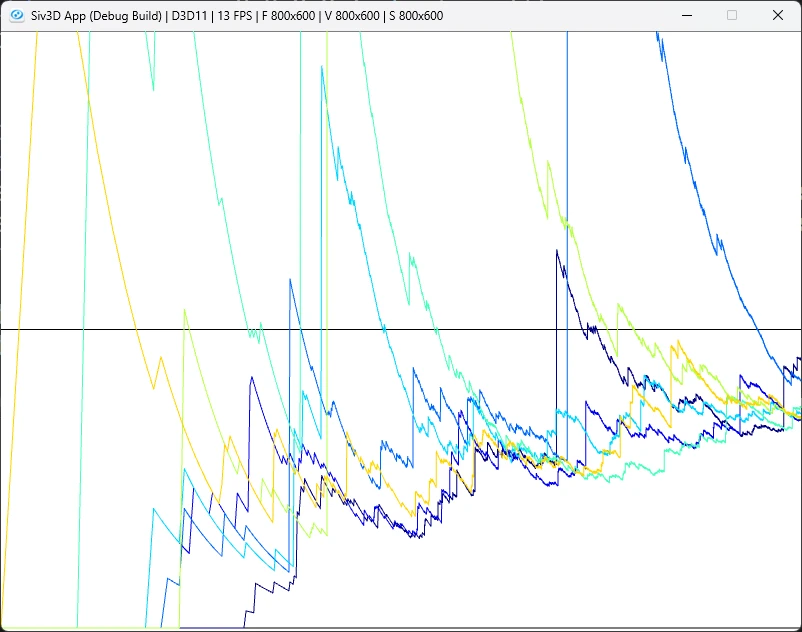
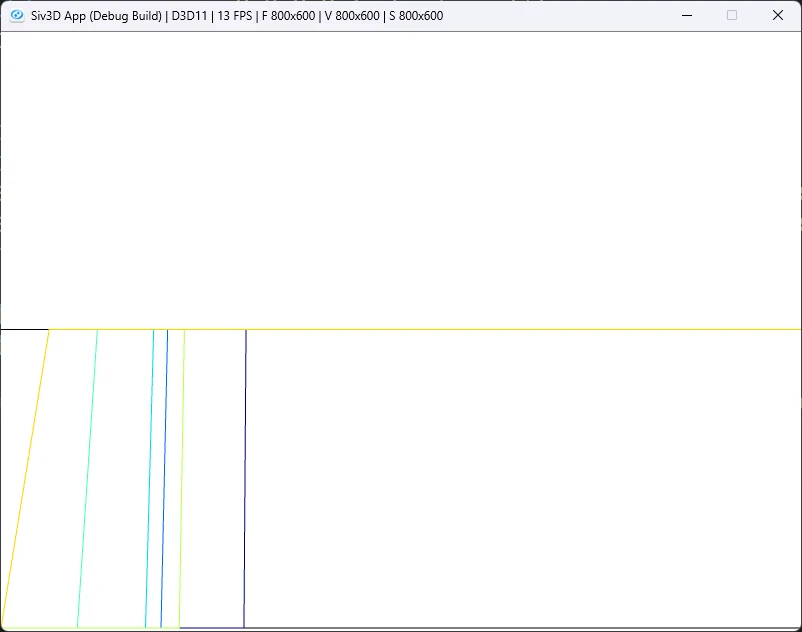

# Infinite Variance: 無限の分散  
5章は最後に例5.5の無限の分散を考えてみよう.  
考えるのは次のような遷移.  

  

右を選択した場合は終端に即座に遷移する.  
ただし、報酬$`R`$は0となる.  
左を選択した場合は$`p=0.9`$,つまり90%の確率で終端に戻り報酬は0のまま.  
そして残りの10%の場合のみ$`R=1`$となり、報酬を得ることができる.  
今回まずは挙動方策として、50%で左、50%で右を選ぶものを選択するようにしてみる.  

まずは行動から、左か右のどちらか.  
```c++
	enum class Action
	{
		LEFT, RIGHT
	};
```

そして行動による選択.  
前回と同じで二項分布を上手く利用する.  
`behavior`がまず挙動方策となる50%で左、50%で右を選ぶような分布.  
言葉の通り挙動方策で使うので、`BehaviorPolicy`ではちゃんとこの分布を使って生成を行う.  
`stateBehavior`は左を選んだ時の行動分布.  
状態数1に対して成功率が0.1なので、10%で終了状態に遷移し、90%でスタート位置に戻るのを表しているのに等しい.  
```c++
	// binormalによる選択
	std::random_device seed_gen;
	std::uint32_t seed = seed_gen();
	std::default_random_engine engine(seed);
	std::binomial_distribution<> behavior(1, 0.5);
	std::binomial_distribution<> stateBehavior(1, 0.1);
	auto BehaviorPolicy = [&]()
		{
			return static_cast<Action>(behavior(engine) == 1);
		};
```

そして今回のターゲット方策、つまり学習したい方策は以下のような感じ.  
```c++
	// ターゲットとなるポリシー
	auto TargetPolicy = []() { return Action::LEFT; };
```
常に左を選び続ける方策,これを選びたいわけだ.  
挙動方策では右を選ぶため、報酬が0になってしまう可能性がある.  
これに対し、ターゲットとなる方策は常に左を選ぶので、報酬が常に1となるということになる.  

さて、行動に関しては簡単なので一気に見てみよう.  
```c++
	// 行動
	auto Play = [&]()
		{
			Array<Action> trajectories;

			int reward = 0;
			while (true)
			{
				auto action = BehaviorPolicy();
				trajectories.push_back(action);

				// 終了
				if (action == Action::RIGHT)
				{
					break;
				}

				// 10%が当たったら終了
				if (stateBehavior(engine) == 1)
				{
					reward = 1;
					break;
				}
			}

			return std::make_tuple(reward, trajectories);
		};
```
挙動方策を使って挙動を生成する.  
生成されたのが右なら即終了、報酬は0である.  
左なら続行するか終了するかを`stateBehavior`で判定.  
終了なら報酬は1にして終了する.  
これでパターンの生成が完了!!  

今回は10本のグラフをグラフ毎に100,000回の反復で収束させていく.  
```c++
	constexpr int runs = 10;
	constexpr int episodes = 100000;
```
実際の本ではこの1000倍のエピソードを回しているが、あまりにも重すぎたのでこれであきらめた.怠惰な実験.  
更に言うと今の10倍くらいなら計算上は問題ないが、なんか描画がSiv3Dだとされなかったのでこれも断念.  
単純に線の数が多すぎるだけなので、先に書きこんで描画は書き込んだものだけとかすればいいんだけどね.  
それをしないのもまた怠惰、やる気が出たらやるかもしれない.  

さて、今回も通常の重点サンプリングと重み付き重点サンプリングをやってみよう.  
計算手順はほぼ同じ.  
まずは結果を収める配列を用意.  
```c++
	Array<Array<double>> results;
	Array<Array<double>> resultsWeighted;
```

まずは各グラフ毎にEpsode計算を行う、`Play`だね.  
```c++
	// 10グラフ分
	for (int r = 0; r < runs; r++)
	{
		Array<double> rewards;
		Array<double> rhos;
		for (int i = 0; i < episodes; i++)
		{
			auto [reward, trajectories] = Play();

            // ...
		}

```

Playをしたら、TargetPolicyと終わり方があってるかを見る.  
合ってれば重点サンプリング率を計算しておく.  
```c++
            double rho = 0.0;
			if (trajectories.back() == TargetPolicy())
			{
				rho = 1.0 / Pow(0.5, trajectories.size());
			}
```
さて、今回の重点サンプリング率がなぜこうなるのか？  
まず挙動分布$`b`$,これは重点サンプリング率を計算する際の分母に相当.  
勿論毎回$`1/2`$の確率で選んでいくため、以下のようになると考えればよい.  

```math
\begin{equation}
    \begin{split}
        b(left|s)= \frac{1}{2}, b(right|s)= \frac{1}{2}
    \end{split}
\end{equation}
```

次に重点サンプリング率の分子となるターゲット方策$`\pi`$.  
こいつは左が100%なので、以下のような感じ.  

```math
\begin{equation}
    \begin{split}
        \pi(left|s)= 1, \pi(right|s)= 0
    \end{split}
\end{equation}
```

こうして考えると、重点サンプリング率は左の場合しかありえないのである.  
右の場合は$`\pi(right|s)`$によって,どんな値になろうとも0になってしまうので.  
あとはこの重点サンプリング率を使って報酬に掛け合わせつつ,rhosを作っておく.  
```c++
			rewards.push_back(rho * reward);
			double prev = i == 0 ? 0.0 : rhos[i - 1];
			rhos.push_back(rho + prev);
```
今回はrhosに突っ込む段階で`partial_sum`と同じような値になるように調整してみた.  
そしたら最後に重点サンプリングを計算すれば終わり.  
通常の場合は`partial_sum`をしたうえで回数を割る.  
重み付きの場合は`partial_sum`をしたうえで、rhoを考慮しつつ割る.  
```c++

		Array<double> estimates;
		Array<double> estimatesWeighted;
		std::partial_sum(rewards.begin(), rewards.end(), std::back_inserter(estimates));
		std::partial_sum(rewards.begin(), rewards.end(), std::back_inserter(estimatesWeighted));
		for (int i = 0; i < estimates.size(); i++)
		{
			estimates[i] /= static_cast<double>(i + 1);
			estimatesWeighted[i] =
				rhos[i] != 0.0 ? estimatesWeighted[i] / rhos[i] : 0.0;
		}
		results.push_back(estimates);
		resultsWeighted.push_back(estimatesWeighted);
	}
```
この結果を見てみよう.  
まずは通常の重点サンプリングの場合から.  

  

普通に考えたら徐々に1に向かうはずなんだけど、なんか全然収束している感じがしない...  
本の画像だとその1000倍計算した形でも収束はしていない状態となる.  
何を隠そう、今回の問題は`無限の分散`という点に問題が潜んでいる...  

何故こんなことになるかと言われると、ターゲット方策と行動方策により計算される重点サンプリング率にある.  
ターゲット方策は今回1しかありえないが、行動方策が非常に長く続く場合は$`\frac{1}{2}`$より$`\rho`$の値はどんどん大きくなっていく.  
今回の分散の計算するとすれば,  

```math
\begin{equation}
    \begin{split}
        E_b[(\prod_{t=0}^{T-1} \rho_{t:T-1}G)^2]
    \end{split}
\end{equation}
```

が分散となるわけだけども、これが無限大となるためこういう問題が起きるわけである.  
要は時々分母にでかい値が入ってくるせいで、中々正しい値に収束せず、ずっと上下してしまってるという訳である...  
単純に0.5を成功し続けた場合に$`2^k`$で増えてくので、9回左を選択した上に10回目も右を引かず左を引いて成功した場合は1024という大きな値になってしまうわけだ.  
基本的には右を引いて失敗して0になる可能性が多いので、この1024というのは非常に大きな値となりえるのである.  

ではこの分散が無限大に発散してしまう問題はどうすればいいか？  
これは単純に意図的に重要度サンプリング率で割る`Weighted Importance Sampling`を使ってあげればよい.  
イメージとして完全に毎回スケーリングを入れてあげてるようなものだね.  
大きい数値が入ったときにはそれに合ったスケールに合わせて重みづけを行うため、今回のように報酬が0 or 1で、しかもそれが$`\rho`$と同期する場合は
```math
\begin{equation}
    \begin{split}
    V(S) \cdot{=} \frac{\sum_{t \in \tau(s)}\rho_{t:T-1} * 1}{\sum_{t \in \tau(s)}\rho_{t:T-1}} \\
    = 1 (分母が0でない場合)
    \end{split}
\end{equation}
```

となってきれいさっぱり消えてすぐに1に収束する!!  
勿論分母が0の場合は0である.この場合はそもそも右しか選んでない状態なので当たり前であるが...  

その結果が次のような感じ.  

  

こんな感じで右を選び続けてる状態では0が続いて、それ以降はずっと1となるわけだ.  
ちょっと推定にはバイアスが存在してるようには感じるけども、解決策としては問題ないのがこの方法である.  
他にもこの無限の分散を解決する方法はあるっぽい.  
が、あくまで今回大事なのはスケーリングさせた重みを掛けて解消する`Weighted Importance Sampling`の凄さが分かるのが一番重要なのではないかなぁ.  
と思いつつ、5章を閉じていきたいなと思ったのであった.  