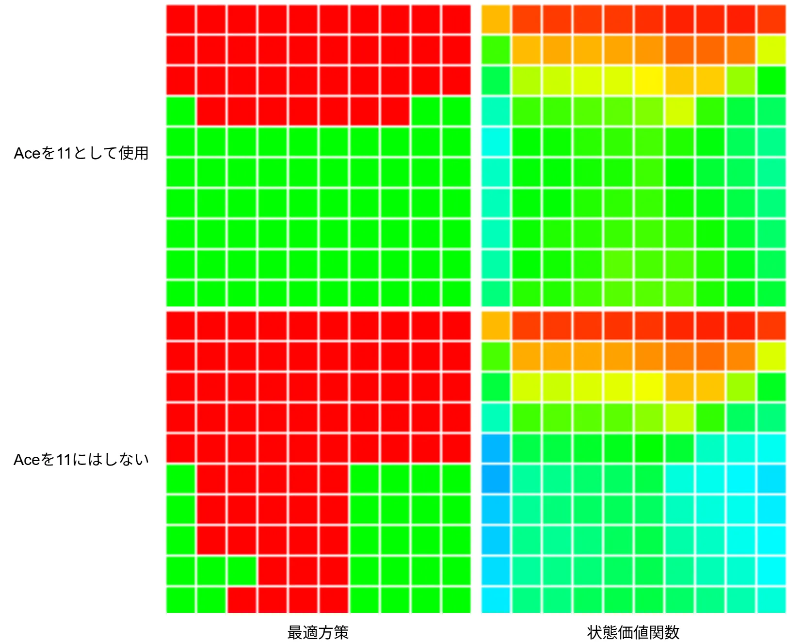

# Monte Carlo ES: モンテカルロES  
今回もモンテカルロをブラックジャックで行っていく.  
前回のプログラムでモンテカルロを計算して、平均化して期待値を求めて、評価を行うことができている.  
しかし、現状改善ができていないという状態.方策改善をしないと学んでいる感じがないよね.  

ではこれをどうやってやるか、今までも使ってきたGreedyな方策で,価値が一番高くなる方策を選ぶだけ.  
```math
\begin{equation}
    \begin{split}
    \pi = arg max_{a} q(s, a)
    \end{split}
\end{equation}
```

こうやって行動に対する報酬を保存しておいて、行動に生かす.  
これをMonte Carlo ESというらしい.  
ESは`Exploring Starts`の略、難しい.  

自分としては本を読んでもう～んとなってしまうため、こういう時はプログラムを見つつ理解していこう.  
ということでブラックジャックを始めようか.  

行動を決めるということはPolicyを決めるということなので、まずはこれを関数化しよう.  
前回のPlayerPolicy,DealerPolicyと同じ風に組んでいく.  
まずは定義、trajectoryとstateの配列をまとめて設定する関数.  
配列はデータ参照用で、trajectoryはデータのどれを参照するかの決定用だね.  
```c++
auto BehaviorPolicy = [&](const Array<double>& stateActionValues, const Array<double> stateActionCounts, Trajectory trajectory)
{
    // ...
};
```
そしてパラメータの設定.  
PlayerがAceを11として使ってるかをindexとして取得.  
そして、プレイヤーの合計とディーラーの1枚目は前回と同じで[0,9]になるように調整を行う.  
```c++
const int playerUseAceEleven = static_cast<int>(trajectory.m_isPlayerUseAceEleven);
const int playerSum = trajectory.m_playerSum - 12;
const int dealerCard = trajectory.m_dealerCardFirst - 1;
```
そしたらactionとplayerがAceを11として使用してるかで参照する位置を確定する.  
前回は単純に1パターンのみに対する状態だったけど、今回は4つのパターン分を保持している.  
これは以下のような感じ.  

* 0: Aceを11として使う + Hitを選択
* 1: Aceを11として使わない + Hitを選択
* 2: Aceを11として使う + Standを選択
* 3: Aceを11として使わない + Standを選択

これを状態として保存してるので、上手くIndexとして選択.  
選択は前回は2次元だったけど、上記のように4つあるので10x10x4のような3次元となるのでindexの参照パターンはちょっと複雑.  
そして、値を取得した後は平均値とActionで値を保持しておく.  
```c++
Array<std::tuple<double, Action>> actionValues, results;
for (auto action : actions)
{
    int index;
    const int actionIndex = static_cast<int>(action);
    switch (playerUseAceEleven)
    {
    case 0:
        if (actionIndex == 0) { index = 0; }
        else { index = 2; }
        break;

    case 1:
        if (actionIndex == 0) { index = 1; }
        else { index = 3; }
    }

    double value = stateActionValues[(playerSum * 10 + dealerCard) + 100 * index];
    double count = stateActionCounts[(playerSum * 10 + dealerCard) + 100 * index];
    actionValues.push_back({ value / count, action });
}
```
後は最大値を選ぶだけこの辺は二章でやったのとほぼ同じ流れ.  
最大値を取って、最大値と同じ値を配列として突っ込む.  
これは同じ値のものが複数あるかものため.  
そして、その中からランダムに値を選ぶ.  
`std::get<1>`で型は`std::tuple<double, Action>`なので、つまりは`Action`が返ってくることになる.  
```c++
// 最大値を放り込んでおく
const auto maxData = *std::max_element(actionValues.begin(), actionValues.end(), [](auto lhs, auto rhs) { return std::get<0>(lhs) < std::get<0>(rhs); });
for (auto value : actionValues)
{
    if (std::get<0>(maxData) == std::get<0>(value))
    {
        results.push_back(value);
    }
}

// 一番大きい手の中からランダムに返す
return std::get<1>(results.choice());
```
こうして行動が選べた.  
一番いい結果を使って行動を選ぶというのはここまでやると非常に分かりやすいね.  

次にPlay関数、これもちょっと改造しておく.  
```c++
	auto Play = [&](Array<Trajectory>& trajectories, int& reward, const bool isFirstEpisode, const Trajectory& initialState, const Array<double>& stateActionValues, const Array<double> stateActionCounts)
		{
            // ...
        };
```
以前と違い変数が大量に追加されてる.  
まずは`isFirstEpisode`,最初のEpisodeかどうかを見分けるための引数.  
次に`initialState`,最初の状態を設定するための引数.  
そして`stateActionValues`と`stateActionCounts`,先ほどの関数でも使ってた状態を表す配列.  
これを渡すことでPlay関数を行える.  

次に変更部分を見ていこう.  
```c++
// 初期状態から値を設定
isPlayerUseAceEleven = initialState.m_isPlayerUseAceEleven;
playerSum = initialState.m_playerSum;
dealerCardFirst = initialState.m_dealerCardFirst;
```
まずは`initialState`,これで初期の状態を指定.  

次はPlayerの行動.  
```c++
bool isInitial = true;
while (true)
{
    Action action;
    if (isInitial)
    {
        // 初回はすでに決めていた行動にする
        action = initialState.m_action;
        isInitial = false;
    }
    else
    {
        // 初回以外はポリシーに従う
        if (isFirstEpisode)
        {
            // 最初の処理の場合はそもそも初期値なので、適当に選ぶようにする
            action = PolicyPlayer(playerSum);
        }
        else
        {
            Trajectory policyTrajectory;
            policyTrajectory.m_playerSum = playerSum;
            policyTrajectory.m_isPlayerUseAceEleven = isPlayerUseAceEleven;
            policyTrajectory.m_dealerCardFirst = dealerCardFirst;

            // 2回目以降はGreedyに選択
            action = BehaviorPolicy(stateActionValues, stateActionCounts, policyTrajectory);
        }
    }

    // ...
}
```
分岐が激しいので分かりにくいが、最初の行動は決定したものを行うだけ.  
それ以降はPolicyに従って行動を決定するが、初回のみはPlayerのポリシー、つまり前回作ったポリシーに従うようにする.  
これ理由は簡単でまだ初回は何の報酬更新が起こってないため、それを避けるためだと思う.  
そしてそれ以降は先ほど作ったポリシーに従って更新、Greedyに最大値を取り、行動を決定することになる.  

ここまででPlayの変更は終わり、次は実際に計算を行う.  
まずは初期状態.  
今回は先ほど言ったようにAceを11として使ってるか、とhitかstandかの2x2で4パターンを用意する.  
```c++
auto MonteCarloES = [&](int episodes)
    {
        // aceを11として使うかの判定による状態 x2
        // hitかstandかの状態 x2
        // 全プレイヤーとディーラーの状態が100なので、合計は100x2x2=400の状態となる
        constexpr int ALL_STATE = 100 * 2 * 2;
        Array<double> stateActionValues(ALL_STATE, 0.0);
        Array<double> stateActionCounts(ALL_STATE, 1.0);

        // ...
    };
```
そしたらepisodes分の計算.  
まずは乱数で初期状態を適当に生成.  
こうすることで色んな開始位置や行動を選択出るようにする.  
```c++
for (int i = 0; i < episodes; i++)
{
    // 初期状態を生成
    Trajectory initState;
    initState.m_isPlayerUseAceEleven = RandomBool();
    initState.m_playerSum = Random(12, 21);
    initState.m_dealerCardFirst = Random(1, 10);
    initState.m_action = actions.choice();

    // ブラックジャックを1回プレイ
    int reward = 0; Array<Trajectory> trajectories;
    Play(trajectories, reward, i == 0, initState, stateActionValues, stateActionCounts);

    // ...
}
```
そしたら次に状態毎の更新.  
これは同じ状態のものは評価しないように注意をしておく.  
ブラックジャックなので多分同じことにはならないとは思うけども...  
```c++
    Array<Trajectory> firstVisitChecks;
    for (const auto& trajectory : trajectories)
    {
        // 同じものは評価しないように
        if (firstVisitChecks.contains(trajectory))
        {
            continue;
        }
        firstVisitChecks.push_back(trajectory); // 登録

        // ...
    }
```
後は先ほどやったのと同じ、[0,9]に正規化してindexの位置を計算して報酬と回数を加算.  
```c++
    {
        // ...

        // 値を正規化しておく
        const int playerUseAceEleven = static_cast<int>(trajectory.m_isPlayerUseAceEleven);
        const int actionIndex = static_cast<int>(trajectory.m_action);
        int playerSum = trajectory.m_playerSum - 12;
        int dealerCard = trajectory.m_dealerCardFirst - 1;

        // indexを確定
        int index;
        switch (playerUseAceEleven)
        {
        case 0:
            if (actionIndex == 0) { index = 0; }
            else { index = 2; }
            break;

        case 1:
            if (actionIndex == 0) { index = 1; }
            else { index = 3; }
        }

        stateActionValues[playerSum * 10 + dealerCard + 100 * index] += reward; // 報酬を加算
        stateActionCounts[playerSum * 10 + dealerCard + 100 * index] += 1.0; // Aceを11として利用した回数を加算
    }
```
最後に平均化をしておく.  
```c++
// 平均にしておく
for (int i = 0; i < stateActionValues.size(); ++i)
{
    stateActionValues[i] /= stateActionCounts[i];
}

return stateActionValues;
```

これで処理は書けたので、結果を見てみよう.  
  
状態価値関数としては同じような感じだね.  
今回は前回とは違って最適方策が分かる.  
赤がスティックで、緑がヒットしている.  
Aceがない場合は基本的にスティックしていて、Aceがある場合は基本的にヒット.  
これ確かに分かる気もするよね、Aceがない場合はやらかす可能性があるので安全に.  
Aceがある場合はもしやらかしてもAceを1にすりゃいいので、勝負してるとも取れるよねこれ.  
こうして行動を可視化すると考察の幅も広がって面白いところ.  

といったところでこれがMonte Carlo ESでした.  