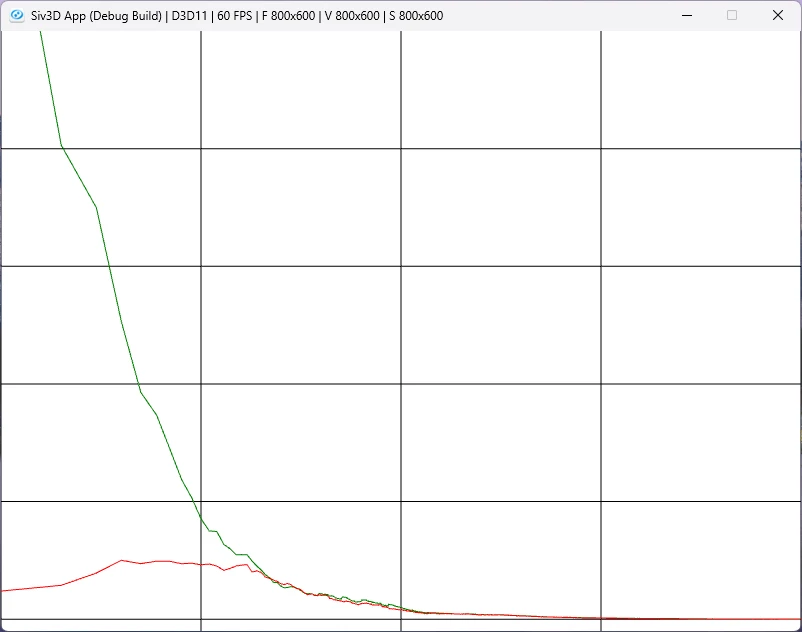

# Off-Policy Learning: 方策オフ型学習  
さて、今までは方策オン型学習というものをやっていた.  
ここで学習には2種類の方策決定があり、

* ターゲット方策: 学習される方策
* 挙動方策: 挙動の生成に使われる方策

というものがあり、方策オン型学習ではどちらも同じ方策を使っている.  
前回のブラックジャックで言えば`BehaviorPolicy`という方策に従っていた.  
方策オフ型ではここが別々のものに分かれる...と言われても何だこりゃ...となると思う、自分はそうなった.  
ということで、今回もブラックジャックを見つつ理解していくことにする.  
本で言うところの例5.4を実際に組んでいる.  

今回はブラックジャックの初期状態は以下のように固定する.  
```c++
auto MonteCarloOffPolicy = [&](int episodes)
{
    // 初期状態を確定させておく
    Trajectory initState;
    initState.m_isPlayerUseAceEleven = true;
    initState.m_playerSum = 13;
    initState.m_dealerCardFirst = 2;

    // ...
};
```
プレイヤーはAceを11として使っており、プレイヤーの現在の得点は13.  
ディーラーの1枚目は2.  
この状態から毎回のEpisodeは始まるわけだ.  

そして、まずは挙動方策,これは二項分布で決める.  
挙動方策は前回で言う`BehaviorPilicy`のことで、ここが二項分布になるわけだ.  
二項分布と言ってはいるが1回で50%の確率で成功する,つまり半々の確率でヒットかスタンドかを決めてるだけである.  
```c++
// binormalによる選択
std::random_device seed_gen;
std::uint32_t seed = seed_gen();
std::default_random_engine engine(seed);
std::binomial_distribution<> dist(1, 0.5);
auto BehaviorPolicyPlayer = [&]()
    {
        return static_cast<Action>(dist(engine) == 1);
    };
```
本ではこの挙動方策が$`b`$に当たる.  
これを使って実際にブラックジャックをプレイするわけだ.  

プレイをするときまでは基本的に同じ.  
```c++
    Array<double> rhos, weightedReturns;
    for (int i = 0; i < episodes; i++)
    {
        // 固定した初期状態で開始
        int reward = 0; Array<Trajectory> trajectories;
        Play(trajectories, reward, initState);
        // ...
    }
```

さて、そしてここで今回学習したいものであるターゲット方策!!  
このターゲット方策は`PolicyPlayer`を利用する.  
挙動は今までもやった通り、20か21の時だけStandするという戦略だった!  
色々書いてあるけど、まずはターゲット方策は`PolicyPlayer`を使っているというのが重要.  
```c++
        // 重要度の比率を用意
        double numerator = 1.0, denominator = 1.0;

        for (const auto& trajectory : trajectories)
        {
            if (trajectory.m_action == PolicyPlayer(trajectory.m_playerSum))
            {
                // 分母を1/2に、つまり値は大きくなる方向へ
                denominator *= 0.5;
            }
            else
            {
                // もし同じじゃないなら重要度0でbreak
                numerator = 0.0;
                break;
            }
        }
```
このターゲット方策は本だと$`\pi`$に該当する.  

このように行動と推定には別の方式を使うというのが方策オフ型というものとなるわけだ.  
ただ、別々の方策を使うため、単純に評価ができない.  
こういう時に便利なのが重点サンプリング！！  

自分もちょっと馴染みがある部分だとレイトレの期待値計算なんかはこれだね.  
レイトレではモンテカルロ積分を求めるために期待値を計算する.  
ただ、雑に光線を飛ばすのでは期待値の収束に時間がかかる...  
そのため、光線を飛ばす方向をライトの方向に極力向くようにすることで効率化する.  
これを堅苦しく言うと、単純な光線を飛ばすような分布の結果を得るためにライト方向に極力飛ばす分布を使うようにするということになる.  
ライト方向に飛ばしても同じ結果が得られて、収束も早いならそっちを採用するべきだよね.  

今回のもやることとしては同じことではあると思う.  
20か21でスタンドするような分布で得られる結果を得るために、二項分布の行動を使うようにするというだけ.  
それで収束が速くなるかどうかは別として、別分布でもちゃんと収束するよ.というのが大事なわけだ.  

ちょっと本の中の式を追ってみよう.  
ターゲット方策$`\pi`$の中で初期状態$`S_{t}`が与えられたときの軌道は以下のような感じ.  
```math
\begin{equation}
    \begin{split}
    &Pr({A_{t}, S_{t+1}, A_{t+1}, \cdots , S_{T}| S_{T}, A_{t:T-1} \sim \pi}) \\
    &= \pi (A_{t}|S_{t})p(S_{t+1}|S_{t},A_{t})\pi (A_{t+1}|S_{t+1}) \cdots p(S_{T}|S_{T-1}, A_{T-1}) \\
    &= \prod_{k=t}^{T-1} \pi(A_{k}|S_{k})p(S_{k+1}|S_{k},A_{k})
    \end{split}
\end{equation}
```
これはブラックジャックで言うところのヒットするかスタンドするかが$`A`$で、$`S`$がその時の手持ちだったりディーラーの1枚目のカードだったりといった情報のこと.  
この情報を基に次の行動をするかを決めているというのを掛け合わせたものが確率として表せるといえると思う.  

そして、この確率をターゲット方策と挙動方策で考えたものが以下.  
```math
\begin{equation}
    \begin{split}
    \rho_{t:T-1} & \dot{=} 
    \frac{\prod_{k=t}^{T-1} \pi(A_{k}|S_{k})p(S_{k+1}|S_{k},A_{k})}{\prod_{k=t}^{T-1} b(A_{k}|S_{k})p(S_{k+1}|S_{k},A_{k})} \\
    & = \frac{\prod_{k=t}^{T-1} \pi(A_{k}|S_{k})}{\prod_{k=t}^{T-1} b(A_{k}|S_{k})}
    \end{split}
\end{equation}
```

これを`重点サンプリング率`という.  
基本的に$`p`$はわからないことが多いので困ったものだけど、こうすると上手く相殺されるのが嬉しいポイント.  
まずはこれを計算するところをコードで見てみよう.  
まず今回は$`\pi`$が分子だが、基本的に行動の基準は決まっていてそれ以外の行動は行えない.  
あくまで$`b`$は二項分布で自分の合計値が20だったとしてもヒットできるけど、$`\pi`$は20と21はスタンド確定だ.  
そのため、基本的に$`b`$と行動が同じ場合は分子は1で、それ以外は0となる.    
```c++
        // 重要度の比率を用意
        double numerator = 1.0, denominator = 1.0;

        for (const auto& trajectory : trajectories)
        {
            if (trajectory.m_action == PolicyPlayer(trajectory.m_playerSum))
            {
                // 初期値が1なので変える必要なし
                // ...
            }
            else
            {
                // もし同じじゃないなら重要度0でbreak
                numerator = 0.0;
                break;
            }
        }
```

分母となる$`b`$の方はどうか？  
二項分布の確率分布は以下の形だった.  
```math
\begin{equation}
    \begin{split}
    P(X=k)= {}_n C_k p^{k}(1-p)^{n-k}
    \end{split}
\end{equation}
```
今回,表と裏の出る確率は$`\frac{1}{2}`$,つまり$`p=\frac{1}{2}`$.  
そして、1回のうち1回成功する確率を考えてみると$`n=1, k=1`$となる.  
これより,  
```math
\begin{equation}
    \begin{split}
    P(X=1) &= {}_1 C_1 \frac{1}{2}^{1}(1-\frac{1}{2})^{1-1} \\
    & = \frac{1}{2} \\
    & = b
    \end{split}
\end{equation}
```
つまり、これで二項分布の場合の行動の数値が分かった.  
1回成功する確率は$`\frac{1}{2}`$,また失敗の場合も$`\frac{1}{2}`$となる.  
成功をヒット、失敗をスタンドと言い換えればよいので、各行動で$`\frac{1}{2}`$を掛けていけばよい.  
```c++
        for (const auto& trajectory : trajectories)
        {
            if (trajectory.m_action == PolicyPlayer(trajectory.m_playerSum))
            {
                // 分母を1/2に、つまり値は大きくなる方向へ
                denominator *= 0.5;
            }
            else
            {
                // もし同じじゃないなら重要度0でbreak
                numerator = 0.0;
                break;
            }
        }
```

こうして重点サンプリング率が求まれば、重点サンプリングの係数を使って期待値の計算ができる.  
```math
\begin{equation}
    \begin{split}
    E[\rho_{t:T-1} G_{t}|S_{t}=s]= v_{\pi}(s)
    \end{split}
\end{equation}
```
価値関数が期待値という形に落とし込まれる.  
期待値ということはこれまでのステップ数で割ることを考えると次のような感じになる.  
```math
\begin{equation}
    \begin{split}
    V(S) \dot{=} \frac{\sum_{t \in \tau(s)}\rho_{t:T-1} G_{t}}{\tau(s)}
    \end{split}
\end{equation}
```

しかし、これでは重点サンプリング比率が大きくなりすぎることで、収束が遅くなったりすることも多い.  
そのため重み付き重点サンプリング(Weighted Importance Sampling)という方法を使うこともある.  
要はステップ数で単純に割るのではなく重みも掛けましょうくらいの塩梅.式は以下の感じ.  
```math
\begin{equation}
    \begin{split}
    V(S) \cdot{=} \frac{\sum_{t \in \tau(s)}\rho_{t:T-1} G_{t}}{\sum_{t \in \tau(s)}\rho_{t:T-1}}
    \end{split}
\end{equation}
```

さて、そしたらこの2つの重点サンプリングを行って、実際どうなのかを見る.  
これが今回のゴール.  
重みとなるものは`rhos`に保存.そして実際の期待値計算時の分子については`WeightedReturns`に保存する.  
`WeightedReturns`は分子なので、Weighted Importance Samplingも通常のImportance Samplingも同じものとなるね.  
```c++
        // 結果を格納
        rhos.push_back(numerator / denominator);
        weightedReturns.push_back(rhos[i] * reward);
```

次に各エピソード毎による部分和を形成.  
これはC++なら`partial_sum`で計算可能.  
```c++
    // 合計を計算しておく
    Array<double> weightedSum(episodes, 0.0);
    Array<double> rhoSum(episodes, 0.0);
    std::partial_sum(weightedReturns.begin(), weightedReturns.end(), weightedSum.begin());
    std::partial_sum(rhos.begin(), rhos.end(), rhoSum.begin());
```

そしたらあとは計算するだけ.  
通常のImportance Samplingは`ordinarySampling`.  
重み付きのImportance Sampling方は`weightedSampling`.  
式の違いを見れば分かりやすい.  
ただし`rho`は0になることもあるため、この場合は0に強制的にする.  
本にも分母が0の場合は0と定義と書いてあるので正しい.  
最後はこれを結果として返すだけ!!  
```c++
    // 系列を計算
    Array<double> ordinarySampling(episodes, 0.0);
    Array<double> weightedSampling(episodes, 0.0);
    for (int i = 0; i < ordinarySampling.size(); i++)
    {
        ordinarySampling[i] = weightedSum[i] / static_cast<double>(i + 1);
        weightedSampling[i] = rhoSum[i] != 0.0 ? weightedSum[i] / rhoSum[i] : 0.0;
    }

    return std::make_pair(ordinarySampling, weightedSampling);
```

今回の例はターゲット方策、つまり20,21でスタンドした際の期待値はわかっており,前々回に計算したときも同じ値になってるはずだけど`-0.27726`.  
そのため、この値との差を見ればどれだけ値が近づいたのかが分かる訳になる.  
エピソード数は10000とし、これを100回行うことで結果を平均してどれくらい近づいてるかを見ることにする.  
```c++
const double trueValue = -0.27726;
const int episodes = 10000;
const int runs = 100;

まずは通常のものと重み付きを用意する.  
そして、実際に計算!!  
計算後はtrueValueとの差を求めてどれだけ近づいたのかを蓄積する.  
```c++
// 結果
Array<double> errorOrdinaries(episodes, 0.0);
Array<double> errorWeighted(episodes, 0.0);

for (int i = 0; i < runs; i++)
{
    auto [ordinaries, weights] = MonteCarloOffPolicy(episodes);

    // powでスケール,trueValueに近くなればなるほど0に近づく
    for (int j = 0; j < episodes; j++)
    {
        double vOrdinary = ordinaries[j] - trueValue;
        double vWeight = weights[j] - trueValue;
        errorOrdinaries[j] += vOrdinary * vOrdinary;
        errorWeighted[j] += vWeight * vWeight;
    }
}
```
最後にruns、つまり100で割って平均を求める.  
```c++
auto divides = [runs](double& v) { v /= runs; };
std::for_each(errorOrdinaries.begin(), errorOrdinaries.end(), divides);
std::for_each(errorWeighted.begin(), errorWeighted.end(), divides);
```
後はグラフ化するだけだけど、グラフ化には1点注意があり対数スケールグラフである点.  
自分はSiv3Dで実装してるため、この辺を自分でスケールしなきゃいけないので最初違う図が出て迷った...  
Siv3Dの場合は`Log10`関数でスケールしてあげればよい.  

さて、結果は以下のような感じ.  
  
緑が通常の重点サンプリング,赤の方が重み付きの重点サンプリングである.  
結果としては最終的には同じだけど,重み付きの方が誤差が最初の方から小さい.  
これは実用上においても大抵はこのような結果になる.  

レイトレなんかはこの誤差が小さいというのはそのままノイズがなくなり、画像の品質向上につながったりするのでこの誤差は非常に重要である.  
今回の例ではまあ固定なのであまり感じられないかもだけども...  
といったところで今回も終わり！  