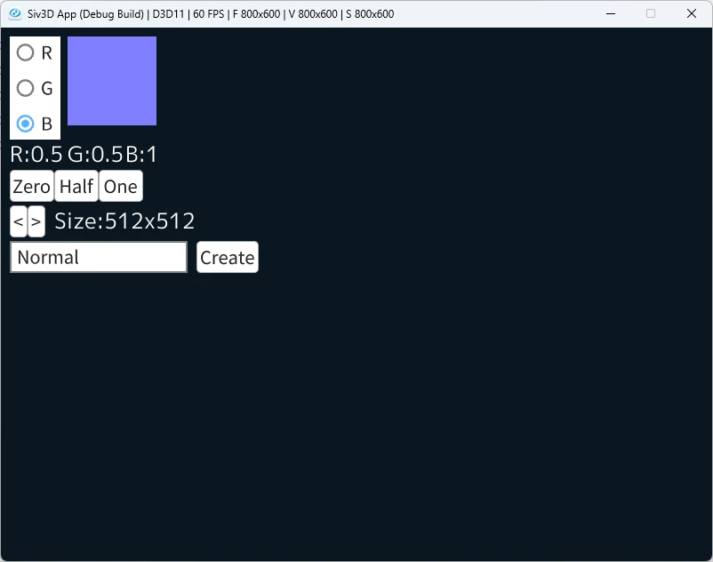

# デフォルトテクスチャを作る機能  
DirectXとかの低レイヤーをやってると、時々デフォルトテクスチャが欲しくなる時がある.  
例えばShaderにTextureを割り当てる際、別段用意されてない場合はデフォルトのテクスチャが欲しいとか.  
正直テクスチャを拾ってきたり、適当にDumpさせればいい話ではあるんだけど、今回は何を血迷ったのかツール作ってみようかなとなった.  
今回はSiv3Dでワンクリックで作るのを目標でやっていくことにする.  

まずは色指定で数値を変えることができる機能を用意する.  
最初はラジオボタンでRGBのどの数値を弄ることができるように.  
```c++
Array<String> colorOptions = { U"R", U"G", U"B" };
size_t colorIndex = 0;

// ...
while (System::Update())
{
    // カラー用ラジオボタン
    SimpleGUI::RadioButtons(colorIndex, colorOptions, Vec2{ 10, 10 });

    // ...
}
```
このラジオボタンの数値を使って、RGBのどれかの数値をポインタとして取得する.  
```c++
// RGB選択
double* color = nullptr;
switch (colorIndex)
{
case 0: color = &targetColor.r; break;
case 1: color = &targetColor.g; break;
case 2: color = &targetColor.b; break;
default:
    break;
}
```
あとは数値の変更だけど、今回はボタンで用意した.  
最初はスクロールバーにしようかと思ったけど、細かい数値の変更が面倒なのよねあれ.  
あと、デフォルトテクスチャだと欲しいの0か1か0.5のどれかなので、ボタンで対応してみた訳である.  
```c++
// 数値変更ボタン
if (color)
{
    if (SimpleGUI::Button(U"Zero", Vec2{ 10, 160 }, 50))
    {
        *color = 0.0;
    }

    if (SimpleGUI::Button(U"Half", Vec2{ 60, 160 }, 50))
    {
        *color = 0.5;
    }

    if (SimpleGUI::Button(U"One", Vec2{ 110, 160 }, 50))
    {
        *color = 1.0;
    }
}
```
テクスチャの色に関しては適宜文字と数値で表示するようにした.  
なので、今の値がどういう色なのかは確認可能.  
```c++
// カラー表示
font(U"R:" + Format(targetColor.r)).draw(Vec2{10, 125});
font(U"G:" + Format(targetColor.g)).draw(Vec2{75, 125});
font(U"B:" + Format(targetColor.b)).draw(Vec2{140, 125});

Rect{ 75, 10, 100, 100 }.draw(targetColor);
```
後はテクスチャのサイズを変えられるボタンも変えた.  
テクスチャのサイズはindex管理で2の倍数で管理することにしている.  
0なら$`2^{0}=1`$で最大は13で$`2^{13}=8192`$となる.  
```c++
// Textureのサイズ用
if (SimpleGUI::Button(U"<", Vec2{ 10, 200 }, 20))
{
    textureIndex--;
    textureIndex = Max(textureIndex, 0); // 2^0=1
}

if (SimpleGUI::Button(U">", Vec2{ 30, 200 }, 20))
{
    textureIndex++;
    textureIndex = Min(textureIndex, 13); // 2^13=8192
}
```
このサイズは表示するようにしている.  
実際のサイズを得るためには右シフトで計算,2の倍数はシフト計算が便利ね.  
```c++
uint32 TextureSize = 1 << textureIndex;
font(U"Size:" + Format(TextureSize)+U"x"+Format(TextureSize)).draw(Vec2{60, 200});
```
そしたら保存のための用意.  
まずはファイル名、これはTextBoxで入力できるようにした.  
```c++
// ファイル名用表示
SimpleGUI::TextBox(fileNameEditState, Vec2{ 10, 240 });
```
あとは作成用のボタンを用意.  
押した場合ファイル名が存在するなら単色のRenderTargetを用意して、それを画像にしてpngとして保存すれば終わり.  
```c++
if (SimpleGUI::Button(U"Create", Vec2{ 220, 240 }, 70))
{
    if (!fileNameEditState.text.isEmpty())
    {
        // 単色のRTを用意
        RenderTexture result{TextureSize, TextureSize, targetColor};

        // 画像にして保存
        Image image{TextureSize, TextureSize};
        result.readAsImage(image);
        image.savePNG(fileNameEditState.text + U".png");
    }
}
```
こうしてできたツールはこんな感じ.  
  
今回はNormalのデフォルトテクスチャを生成してみた.  
いい感じ、自分がやりたいことはできたので満足.  
MeshShaderの方で使った感じいけたので、また何かしらデフォルトテクスチャを作りたくなったらまた使おうと思う.  